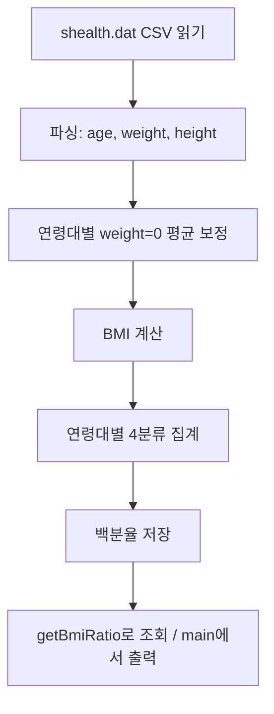
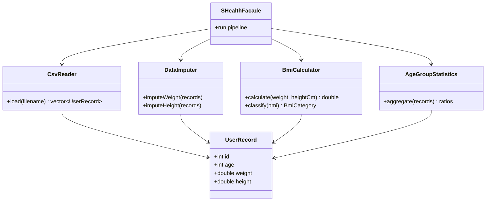

# SHealth_08 프로젝트 분석 보고서

| 항목 | 내용 |
|------|------|
| **프로젝트명** | SHealth BMI (C++) |
| **작성일** | 2026-05-19 |
| **목적** | README·소스 코드 분석, 코드 스멜 정리, `.cursorrules` 수립 근거 문서화 |

---

## 1. 개요

### 1.1 배경
삼성 헬스 스타일의 건강 데이터를 활용하여, 사용자 **나이대별**(20대, 30대, …) **BMI 분포 통계**(저체중 / 정상 / 과체중 / 비만 비율)를 계산하는 C++ 실습 프로젝트이다.

### 1.2 핵심 요구사항 (README 기준)

| 항목 | 규칙 |
|------|------|
| 입력 | CSV: `id`, `age`, `weight(kg)`, `height(cm)` |
| BMI | 체중(kg) ÷ 키(m)² |
| 저체중 | BMI ≤ 18.5 |
| 정상체중 | 18.5 < BMI < 23 |
| 과체중 | 23 ≤ BMI < 25 |
| 비만 | BMI ≥ 25 |
| 누락 체중 | weight = 0 → **동일 연령대** 유효 체중의 평균으로 대체 |
| 연령대 | 10년 단위 (예: 20대 = 20 ≤ age < 30) |
| 출력 | 연령대별 각 BMI 범주 **비율(%)** |

### 1.3 실습 목표
- 의도적으로 포함된 **코드 스멜** 분석 및 제거
- **TDD**(Google Test) 기반 단위 테스트 작성
- **클린코드·SRP** 리팩토링 및 기능 확장 (6시간 Activities)

---

## 2. 기술 스택 및 빌드

| 구분 | 내용 |
|------|------|
| 언어 | C++17 |
| 빌드 | CMake 3.10+ |
| 테스트 | Google Test v1.14.0 (`FetchContent` 자동 다운로드) |
| 실행 파일 | `SHealthBMI` |
| 라이브러리 | `shealth_lib` (`SHealth.cpp`) |

### 2.1 빌드·실행·테스트

```bash
mkdir build && cd build
cmake ..
cmake --build .

# 실행 (Windows: build\Debug\SHealthBMI.exe)
./SHealthBMI

# 테스트
cd build && ctest
```

### 2.2 프로젝트 구조

```
Shealth_08/
├── CMakeLists.txt
├── shealth.dat              # 입력 데이터
├── .cursorrules             # Cursor AI 코딩 가이드
├── Report/                  # 본 보고서
├── src/
│   ├── main/cpp/
│   │   ├── SHealth.h
│   │   ├── SHealth.cpp
│   │   └── SHealthBMI.cpp
│   └── test/cpp/
│       └── SHealthBMITest.cpp
└── README.md
```

---

## 3. 현재 코드 구조 분석

### 3.1 클래스 역할

| 파일 | 역할 |
|------|------|
| `SHealth.h` / `SHealth.cpp` | CSV 로드, 체중 보정, BMI 계산, 연령대별 통계, 비율 조회 |
| `SHealthBMI.cpp` | `main` — `shealth.dat` 처리 후 연령대별 결과 `printf` 출력 |
| `SHealthBMITest.cpp` | Google Test (현재 `FailedTest`만 존재, `FAIL()` 상태) |

### 3.2 처리 흐름



### 3.3 주요 API

```cpp
// SHealth.h
int calculateBmi(const std::string& filename);  // 전체 파이프라인, 레코드 수 반환
double getBmiRatio(int ageClass, int type);       // ageClass: 20~70, type: 100~400
```

- `type` 매핑: `100` 저체중, `200` 정상, `300` 과체중, `400` 비만 (매직 넘버)

---

## 4. 코드 스멜 분석 (Before)

README에 명시된 대로, 제공 코드에는 품질 개선이 필요한 패턴이 다수 존재한다.

### 4.1 God Class (단일 책임 위반)

`SHealth` 한 클래스가 다음을 모두 수행한다.

- 파일 I/O 및 CSV 파싱
- 결측치(체중 0) 보정
- BMI 계산
- 연령대별 통계 집계
- 결과 조회 API

**개선 방향**: `CsvReader`, `DataImputer`, `BmiCalculator`, `AgeGroupStatistics` 등으로 SRP 분리.

### 4.2 매직 넘버·하드코딩

| 위치 | 문제 |
|------|------|
| `getBmiRatio` | `type` 100/200/300/400, `ageClass` 20~70 |
| BMI 분류 | 18.5, 23, 25 리터럴 반복 |
| 멤버 배열 | 고정 크기 `10000` |
| `main` | 연령대·타입 조합 `printf` 5회 반복 |

### 4.3 데이터 구조 중복

연령대(6) × BMI 범주(4) = **24개** 개별 멤버 변수:

`underweight20`, `normalweight30`, `obesity70` 등.

**개선 방향**: `std::map` 또는 `std::array` + `enum class BmiCategory` / `AgeGroup`.

### 4.4 긴 조건 분기 (Long Method / Shotgun)

- `calculateBmi`: 약 100줄, 다단계 루프·`if (a == 20) else if (a == 30) ...` 반복
- `getBmiRatio`: 24개 분기 `if-else` 체인

### 4.5 네이밍·일관성

| 이슈 | 예시 |
|------|------|
| 축약·모호 | `count`, `sum`(인원 합계와 혼동 가능) |
| public API와 private 데이터 혼재 | 통계 결과가 private 멤버에 산재 |
| 출력 스타일 혼용 | `SHealth.cpp`는 `iostream`, `SHealthBMI.cpp`는 `printf` |

### 4.6 README와 구현 불일치 (잠재 버그)

| 구분 | README | 현재 `SHealth.cpp` |
|------|--------|-------------------|
| 비만 | BMI **≥ 25** | `bmis[i] > 25` (25 미포함) |
| 과체중 상한 | 25 **미만** | `bmis[i] < 25` (일치) |

BMI가 정확히 **25.0**인 경우 README는 비만, 현재 코드는 과체중으로 분류될 수 있다. 리팩토링·테스트 작성 시 **경계값 TC**로 반드시 검증할 것.

### 4.7 테스트 부재

`SHealthBMITest.cpp`는 `TEST(SHealthBMITest, FailedTest) { FAIL(); }` 만 존재하여, `ctest` 실행 시 실패한다.

---

## 5. 도메인 로직 상세

### 5.1 BMI 계산

```
height_m = height_cm / 100
BMI = weight_kg / (height_m)²
```

구현 예 (`SHealth.cpp` 51~53행):

```cpp
bmis[i] = weights[i] / ((heights[i] / 100.0) * (heights[i] / 100.0));
```

### 5.2 체중 0 보정 알고리즘

1. 연령대 `a` ∈ {20, 30, 40, 50, 60, 70}에 대해:
2. 해당 구간(`a ≤ age < a+10`)에서 `weight ≠ 0`인 값만으로 평균 `sum / ageCount` 계산
3. 같은 구간에서 `weight == 0`인 레코드에 평균 적용

### 5.3 연령대별 비율

```
비율(%) = (해당 범주 인원 / 해당 연령대 전체 인원) × 100
```

---

## 6. 실습 로드맵 (Activities 6시간)

| 단계 | 시간 | 내용 | 산출물 |
|------|------|------|--------|
| 1 | 1h | 코드 구조·BMI 로직 이해, 코드 스멜 목록화 | 스멜 체크리스트 (본 보고서 §4) |
| 2 | 1h | 네이밍, 하드코드 제거, 함수 추출, 중복 제거 | 1차 리팩토링 코드 |
| 3 | 1h | Google Test TC 작성 | BMI·보정·분류·예외 테스트 |
| 4 | 2h | SRP 분리, 기능 4종 추가 | 확장 API·구조 개선 |
| 5 | 1h | 회고·발표 | Before/After, AI 활용 회고 |

### 6.1 기능 개선 예정 (Activities 4)

1. 특정 연령대 BMI 분포 비율 조회 (기존 기능 정리·API 개선)
2. **Height = 0** 연령대 평균 보정 (체중 보정과 동일 패턴)
3. BMI **정상 범위** 사용자 ID 목록 조회
4. **전체 사용자** 대비 BMI 범주별 비율

### 6.2 권장 클래스 분리 (목표 설계)



---

## 7. 단위 테스트 계획

### 7.1 필수 테스트 영역

| # | 영역 | 예시 케이스 |
|---|------|-------------|
| 1 | BMI 계산 | 키 170cm, 체중 70kg → 기대 BMI |
| 2 | 체중 보정 | 동일 연령대 weight 0 → 평균 대체 |
| 3 | 분류 경계 | 18.5, 23.0, 25.0 각각 기대 범주 |
| 4 | 연령대 통계 | 소규모 fixture CSV → 비율 검증 |
| 5 | 예외 | 빈 파일, 파싱 오류, 유효 체중 0명 연령대 |

### 7.2 TDD 진행 순서

1. 실패하는 테스트 작성 (`EXPECT_*` / `ASSERT_*`)
2. 최소 구현으로 통과
3. 리팩토링 후 `ctest` 전체 통과 유지

### 7.3 테스트 네이밍 예시

```
CalculateBmi_GivenHeightInCm_ReturnsCorrectValue
ImputeWeight_WhenZero_UsesAgeGroupAverage
ClassifyBmi_AtBoundary25_ReturnsObesity
```

---

## 8. `.cursorrules` 수립 요약

프로젝트 루트에 **Cursor AI 에이전트용 코딩 규칙** 파일을 생성하였다.

| 파일 | 경로 |
|------|------|
| `.cursorrules` | `c:\DEV\Shealth_08\.cursorrules` |

### 8.1 포함 내용

- 프로젝트 목적·빌드 명령·디렉터리 구조
- README 기준 **도메인 규칙** (BMI, 분류, 연령대, 보정)
- 제거 대상 **코드 스멜** 목록 및 SRP/STL 가이드
- **TDD·Google Test** 필수 영역 및 네이밍 규칙
- AI 동작 원칙 (단계적 리팩토링, 한국어 응답, git 자동 커밋 금지)

### 8.2 활용 방법

- Cursor에서 본 프로젝트 작업 시 에이전트가 `.cursorrules`를 자동 참조
- 리팩토링·테스트 추가 요청 시 도메인 규칙·경계값 불일치를 일관되게 적용

---

## 9. 결론 및 권장 다음 단계

### 9.1 현재 상태 요약

| 항목 | 상태 |
|------|------|
| 핵심 BMI·통계 로직 | 동작 가능 (경계값 25 검증 필요) |
| 코드 품질 | 개선 필요 (의도된 스멜 다수) |
| 단위 테스트 | 미구현 (`FAIL()` 플레이스홀더) |
| AI 코딩 가이드 | `.cursorrules` 완료 |
| 분석 문서 | 본 보고서 (`Report/`) |

### 9.2 권장 작업 순서

1. **경계값 버그** 수정 및 분류 TC 추가 (BMI 25.0)
2. **실패 테스트 제거** → BMI·보정·분류 TC부터 TDD
3. **매직 넘버 → enum/상수**, 24개 멤버 → 구조체/컨테이너 통합
4. **SRP 분리** 후 Activities 4 기능 추가
5. `ctest` 전체 통과 후 회고(Activities 5) 작성

---

## 부록 A. 참고 파일 목록

| 파일 | 설명 |
|------|------|
| `README.md` | 요구사항·Activities·빌드 안내 |
| `.cursorrules` | Cursor AI 프로젝트 규칙 |
| `TDD 기반 암호 검사기 또는 BMI 프로젝트용 프롬프트.txt` | TDD·리팩토링 프롬프트 예시 |
| `shealth.dat` | 실제 입력 샘플 데이터 |

## 부록 B. 생성형 AI 활용 프롬프트 예시

```
BMI 계산기에 대해 TDD를 시작하고 싶어.
1. BMI 계산  2. 평균 보정(weight=0)  3. BMI 분류  4. 연령대별 통계
위 4가지에 대해 실패하는 Google Test부터 작성해줘.
```

```
현재 SHealth.cpp를 클린코드(SRP, DRY, 매직넘버 제거)로 리팩토링해줘.
README BMI 경계값(특히 25)과 테스트 통과를 유지해줘.
```

---

*본 문서는 SHealth_08 초기 코드베이스 및 README 분석을 바탕으로 작성되었습니다.*
