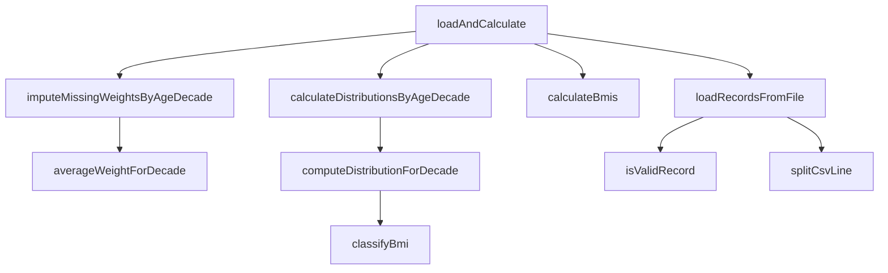

# SHealth_08 — 02-01단계: 네이밍 개선 리팩토링

> **통합 최종본**: [02_SHealth_08_1차_리팩토링_보고서.md](./02_SHealth_08_1차_리팩토링_보고서.md)  
> **관련 문서**: [02-02](./02-02단계%20—%20하드코드%20및%20전역변수%20제거%20리팩토링.md) · [02-03](./02-03단계%20—%20함수%20추출%20리팩토링.md) · [02-04](./02-04단계%20—%20반복중복%20제거%20리팩토링.md) · [목록](./README.md)
| 항목 | 내용 |
|------|------|
| **프로젝트명** | SHealth BMI (C++) |
| **작성일** | 2026-05-20 |
| **단계** | Activities 2 — 1차 리팩토링 (클린코드 관점) |
| **선행 문서** | [01_SHealth_08_프로젝트_분석_보고서.md](./01_SHealth_08_프로젝트_분석_보고서.md) |
| **목적** | 네이밍 개선, 하드코드·전역 배열 제거, 함수 추출, 중복 제거 및 검증 로직 반영 |

---

## 1. 개요

### 1.1 작업 범위

README Activities **2단계(1시간)** 에 해당하는 **1차 리팩토링**을 전체 프로젝트에 적용하였다.

| 항목 | 수행 여부 |
|------|-----------|
| 네이밍 개선 | ✅ |
| 하드코드 및 고정 배열 제거 | ✅ |
| 함수 추출 | ✅ |
| 반복/중복 제거 | ✅ |
| 입력 검증 (`age > 0`, `id ≥ 0`, `height ≥ 0`) | ✅ |
| BMI 경계값 버그 수정 (25.0 → 비만) | ✅ |
| 단위 테스트 플레이스홀더 제거·기초 TC 추가 | ✅ (부분) |

**미수행** (Activities 4 예정): SRP 기반 클래스 분리, Height=0 보정, 정상 BMI 사용자 목록, 전체 대비 비율 API.

### 1.2 적용 제약 조건

| 필드 | 규칙 | 구현 |
|------|------|------|
| `age` | 0일 수 없음 | `age > 0` 미만족 시 레코드 스킵 |
| `id` | 0 이상 | `id >= 0` |
| `height` | 0 이상 | `heightCm >= 0.0` (0 허용, BMI 계산 시 0은 별도 처리) |

검증 진입점: `SHealth::isValidRecord(int id, int age, double heightCm)`.

---

## 2. Before / After 요약

### 2.1 구조 비교

| 구분 | Before | After |
|------|--------|-------|
| 데이터 저장 | `int ages[10000]` 등 C 배열 4종 | `std::vector<HealthRecord> records_` |
| 통계 저장 | 연령대×범주 **24개** `double` 멤버 | `std::unordered_map<int, AgeGroupDistribution>` |
| BMI 분류 | `if-else` 리터럴 (18.5, 23, 25) | `classifyBmi()` + `constexpr` 상수 |
| 연령대 통계 | `if (a == 20) ... else if (a == 70)` ×6 | `computeDistributionForDecade()` 루프 |
| 비율 조회 | `getBmiRatio` 24분기 `if-else` | `switch` + map 조회 |
| 진입 API | `calculateBmi()` | `loadAndCalculate()` |
| 테스트 | `FAIL()` 단일 테스트 | 분류·검증·로드 스모크 3건 |

### 2.2 코드 규모 (대략)

| 파일 | Before (줄) | After (줄) | 비고 |
|------|-------------|------------|------|
| `SHealth.h` | 28 | 60 | 구조체·enum·private 메서드 선언 |
| `SHealth.cpp` | 148 | 208 | 함수 분리로 줄 수는 증가, 단일 메서드 복잡도는 감소 |
| `SHealthBMI.cpp` | 28 | 32 | 출력 헬퍼 추출 |
| `SHealthBMITest.cpp` | 6 | 26 | 기초 TC 3개 |

---

## 3. 네이밍 개선

### 3.1 API·멤버 변경표

| Before | After | 의미 |
|--------|-------|------|
| `calculateBmi(filename)` | `loadAndCalculate(filename)` | 파일 로드 + 보정 + BMI + 통계 파이프라인 |
| `count` | `records_.size()` | 로드된 유효 레코드 수 |
| `split(line, delim)` | `splitCsvLine(line, delim)` | CSV 한 줄 토큰 분리 |
| `getBmiRatio(ageClass, type)` | *(시그니처 유지)* | `ageClass` → 연령대 십의 자리(`ageDecade`), `type` → `categoryCode` |
| `ages[]`, `weights[]`, … | `HealthRecord` 필드 | `age`, `weightKg`, `heightCm`, `bmi` |
| `underweight20` 등 | `AgeGroupDistribution::underweightPercent` 등 | map 값으로 통합 |

### 3.2 타입·열거형

```cpp
enum class BmiCategory {
    Underweight = 100,
    Normal      = 200,
    Overweight  = 300,
    Obesity     = 400
};
```

- 기존 `main`·호출부의 `100/200/300/400` 매직 넘버와 **호환**되도록 enum 값 유지.
- `SHealthBMI.cpp`에서는 `kCategoryUnderweight` 등 이름 있는 상수로 래핑.

### 3.3 main 진입점

| Before | After |
|--------|-------|
| `SHealth shealth` | `SHealth healthService` |
| 5회 반복 `printf` 블록 | `printAgeDecadeDistribution()` + `for` 루프 |

---

## 4. 하드코드·데이터 구조 제거

### 4.1 상수화 (`SHealth.h`)

```cpp
static constexpr int kMinAgeDecade = 20;
static constexpr int kMaxAgeDecade = 70;
static constexpr int kAgeDecadeStep = 10;

static constexpr double kUnderweightMaxBmi = 18.5;
static constexpr double kNormalMaxBmi      = 23.0;
static constexpr double kOverweightMaxBmi  = 25.0;
```

### 4.2 고정 배열 제거

**Before** (`SHealth.h`):

```cpp
int count = 0;
int ages[10000];
double heights[10000];
double weights[10000];
double bmis[10000];
```

**After**: `std::vector<HealthRecord> records_` — 레코드 수 제한 없음, RAII·STL 컨테이너 활용.

### 4.3 24개 통계 멤버 제거

**Before**: `underweight20` … `obesity70` (6연령대 × 4범주).

**After**:

```cpp
std::unordered_map<int, AgeGroupDistribution> distributionsByDecade_;
```

연령대 키: `20`, `30`, …, `70` (`ageToDecade()`로 산출).

---

## 5. 함수 추출

### 5.1 책임 분리 (클래스 내부)



| 메서드 | 역할 |
|--------|------|
| `loadRecordsFromFile` | CSV 파싱, 검증, `records_` 적재 |
| `imputeMissingWeightsByAgeDecade` | `weightKg == 0` → 동일 연령대 평균 대체 |
| `calculateBmis` | 키(cm)→m 변환 후 BMI 산출 |
| `averageWeightForDecade` | 연령대별 유효 체중 평균 |
| `computeDistributionForDecade` | 한 연령대의 4범주 **비율(%)** 계산 |
| `calculateDistributionsByAgeDecade` | 20~70대 map 채우기 |
| `classifyBmi` | README 기준 4분류 |
| `ageToDecade` | `(age / 10) * 10` — 20대=20~29 등 |

### 5.2 파이프라인 (공개 API)

```cpp
size_t SHealth::loadAndCalculate(const std::string& filename) {
    if (!loadRecordsFromFile(filename)) {
        return 0;
    }
    imputeMissingWeightsByAgeDecade();
    calculateBmis();
    calculateDistributionsByAgeDecade();
    return records_.size();
}
```

---

## 6. 중복 제거

### 6.1 연령대 루프 통합

**Before**: 체중 보정·통계 집계 각각 `for (a = 20; a <= 70; a += 10)` + 연령대별 `if (a == 20) else if …`.

**After**: 동일 범위를 `kMinAgeDecade` / `kMaxAgeDecade` / `kAgeDecadeStep` 상수로 순회, 연령대별 분기는 map·함수 호출로 대체.

### 6.2 `getBmiRatio` 단순화

**Before**: 24개 `if-else` 분기.

**After**: map 조회 + `switch (BmiCategory)` 4갈래.

### 6.3 main 출력

**Before**: 20/30/40/50/60/70대 `printf` 6블록 (내용 동일).

**After**:

```cpp
for (int ageDecade = 20; ageDecade <= 70; ageDecade += 10) {
    printAgeDecadeDistribution(healthService, ageDecade);
}
```

---

## 7. 도메인 로직 변경·버그 수정

### 7.1 BMI 25.0 경계값

| BMI | README | Before | After |
|-----|--------|--------|-------|
| 25.0 | **비만** (≥ 25) | 과체중 (`> 25`만 비만) | **비만** (`classifyBmi`) |

```cpp
if (bmi < kOverweightMaxBmi) {  // < 25
    return BmiCategory::Overweight;
}
return BmiCategory::Obesity;      // >= 25
```

### 7.2 입력 검증

```cpp
bool SHealth::isValidRecord(int id, int age, double heightCm) {
    return id >= 0 && age > 0 && heightCm >= 0.0;
}
```

- `age == 0` 레코드는 로드 단계에서 제외.
- `heightCm == 0`은 허용하나, BMI 계산 시 `0`으로 두어 분류 집계에 영향 (향후 Height 보정 시 개선 예정).

### 7.3 체중 0 보정

알고리즘은 분석 보고서(§5.2)와 동일하나, 구현은 `averageWeightForDecade` + `imputeMissingWeightsByAgeDecade`로 분리.

---

## 8. 빌드·실행·테스트 결과

### 8.1 빌드

```bash
cd build
cmake ..
cmake --build .
```

- Google Test `FetchContent` 사용 시 SSL 이슈 환경에서는 `CMAKE_TLS_VERIFY=0` 설정이 필요할 수 있음.

### 8.2 실행 (프로젝트 루트)

```bash
./build/SHealthBMI.exe   # Windows
```

**출력 예** (`shealth.dat` 기준):

```
20 - underweight = 3.511053, normal = 23.797139, overweight = 11.833550, obesity = 60.858257
30 - underweight = 1.863354, normal = 15.527950, overweight = 10.062112, obesity = 72.546584
40 - underweight = 0.521512, normal = 10.039113, overweight = 9.126467, obesity = 80.312907
50 - underweight = 2.181401, normal = 12.629162, overweight = 9.988519, obesity = 75.200918
60 - underweight = 0.862895, normal = 8.533078, overweight = 10.642378, obesity = 79.961649
70 - underweight = 0.529101, normal = 12.345679, overweight = 10.758377, obesity = 76.366843
```

> BMI 25.0을 비만으로 분류하도록 수정되었으므로, Before 대비 **비만 비율이 소폭 증가**할 수 있다 (분석 보고서 §4.6 예측과 일치).

### 8.3 단위 테스트

```bash
cd build && ctest --output-on-failure
```

| 테스트 | 내용 | 결과 |
|--------|------|------|
| `ClassifyBmiCategories` | 18.5, 23.0, 25.0 경계 | Pass |
| `RejectsInvalidAge` | `age == 0` 거부 | Pass |
| `LoadSampleDataFile` | `shealth.dat` 로드 | Pass |

`CMakeLists.txt`: `gtest_discover_tests(..., WORKING_DIRECTORY ${CMAKE_SOURCE_DIR})` 추가.

---

## 9. 변경 파일 목록

| 파일 | 변경 유형 |
|------|-----------|
| `src/main/cpp/SHealth.h` | 구조·API·상수·컨테이너 |
| `src/main/cpp/SHealth.cpp` | 전면 리팩토링 |
| `src/main/cpp/SHealthBMI.cpp` | 네이밍·출력 헬퍼 |
| `src/test/cpp/SHealthBMITest.cpp` | `FAIL()` 제거, TC 3개 |
| `CMakeLists.txt` | 테스트 working directory |

---

## 10. 코드 품질 Before / After

| 평가 항목 | Before | After |
|-----------|--------|-------|
| 가독성 | 단일 100줄 메서드, 매직 넘버 | 단계별 private 메서드, 이름 있는 상수 |
| 유지보수 | 연령대 추가 시 멤버·분기 多 | map·루프로 확장 용이 |
| 안전성 | 배열 오버플로우 위험 | `vector`, 검증 함수 |
| 테스트 용이성 | `FAIL()` only | `classifyBmi`, `isValidRecord` 단위 검증 가능 |
| SRP | God Class | **부분 개선** (여전히 단일 클래스) |
| README 일치 | BMI 25 불일치 | **일치** |

---

## 11. 남은 과제 (Activities 3~4)

### 11.1 단위 테스트 (Activities 3)

| # | 영역 | 현재 | 권장 |
|---|------|------|------|
| 1 | BMI 계산 수치 | 미작성 | fixture 기반 `EXPECT_DOUBLE_EQ` |
| 2 | 체중 0 보정 | 미작성 | 소규모 CSV fixture |
| 3 | 연령대 통계 비율 | 미작성 | 인원 수 고정 데이터로 % 검증 |
| 4 | 예외·엣지 | 일부 | 빈 파일, 보정 불가 연령대, `height=0` |

### 11.2 기능·구조 (Activities 4)

1. **SRP 분리**: `CsvReader`, `DataImputer`, `BmiCalculator`, `AgeGroupStatistics` (분석 보고서 §6.2 참고)
2. **Height = 0** 연령대 평균 보정
3. BMI **정상 범위** 사용자 목록 조회 API
4. **전체 사용자** 대비 BMI 범주 비율

### 11.3 권장 작업 순서

1. 체중 보정·BMI 계산 TC 추가 (TDD)
2. 소규모 fixture CSV로 연령대 통계 회귀 테스트
3. SRP 분리 후 Activities 4 기능 추가
4. 회고 보고서 (Activities 5) — AI 활용·TC 영향 기록

---

## 12. 결론

1차 리팩토링으로 **의도된 코드 스멜(매직 넘버, 24개 멤버, God Method, C 배열)** 을 제거하고, **모던 C++(STL, enum class, constexpr, 구조체)** 스타일로 정리하였다. README 도메인 규칙 중 **BMI 25.0 비만 분류**와 **입력 검증(age > 0)** 을 반영했으며, `getBmiRatio` API는 기존 호출 코드와 호환된다.

다음 단계는 **Activities 3(단위 테스트 확충)** → **Activities 4(SRP·기능 4종)** 순으로 진행하는 것을 권장한다.

---

## 부록 A. 주요 타입 정의 (`SHealth.h`)

```cpp
struct HealthRecord {
    int id;
    int age;
    double weightKg;
    double heightCm;
    double bmi;
};

struct AgeGroupDistribution {
    double underweightPercent;
    double normalPercent;
    double overweightPercent;
    double obesityPercent;
};
```

## 부록 B. 분석 보고서 대비 체크리스트

| 분석 보고서(§4) 스멜 | 1차 리팩토링 |
|---------------------|--------------|
| God Class | 부분 완화 (메서드 분리, 클래스는 유지) |
| 매직 넘버 | ✅ enum + constexpr |
| 24개 멤버 중복 | ✅ map + struct |
| Long Method / Shotgun if | ✅ 함수 추출 |
| 네이밍 | ✅ |
| BMI 25 버그 | ✅ |
| 테스트 부재 | △ 기초 3건 (확충 필요) |

---

*본 문서는 2026-05-20 수행한 SHealth_08 1차 리팩토링 결과를 바탕으로 작성되었습니다.*
