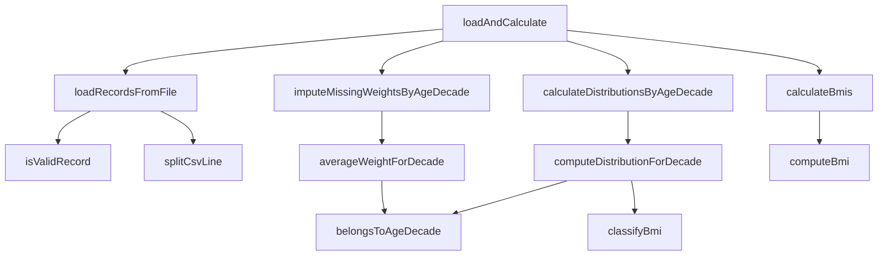

# SHealth_08 — 02-02단계: 하드코드 및 전역변수 제거

> **통합 최종본**: [02_SHealth_08_1차_리팩토링_보고서.md](./02_SHealth_08_1차_리팩토링_보고서.md)  
> **관련 문서**: [02-01](./02-01단계%20—%20네이밍%20개선%20리팩토링.md) · [02-03](./02-03단계%20—%20함수%20추출%20리팩토링.md) · [02-04](./02-04단계%20—%20반복중복%20제거%20리팩토링.md) · [목록](./README.md)

| 항목 | 내용 |
|------|------|
| **프로젝트명** | SHealth BMI (C++) |
| **작성일** | 2026-05-20 |
| **단계** | Activities 2-2 — 하드코드·고정 배열 제거, 함수 추출 |
| **선행 문서** | [01_SHealth_08_프로젝트_분석_보고서.md](./01_SHealth_08_프로젝트_분석_보고서.md) |
| **목적** | `constexpr`·STL·map 도입, God Method 분해, main 중복 제거 |

---

## 1. 개요

### 1.1 작업 범위

README Activities **2단계**에 해당하는 **전체 프로젝트 1차 리팩토링**을 수행하였다.

| 항목 | 수행 여부 |
|------|-----------|
| 네이밍 개선 | ✅ |
| 하드코드 및 고정 배열·전역 상태 제거 | ✅ |
| 함수 추출 | ✅ |
| 반복/중복 제거 | ✅ |
| 입력 검증 (`id ≥ 0`, `age > 0`, `height ≥ 0`) | ✅ |
| BMI 경계값 수정 (BMI 25.0 → 비만) | ✅ |
| 단위 테스트 기초 TC 추가 | ✅ (7건) |

**미수행** (Activities 4 예정): SRP 기반 클래스 분리, Height=0 보정, 정상 BMI 사용자 목록, 전체 대비 BMI 범주 비율 API.

### 1.2 적용 제약 조건

| 필드 | 규칙 | 구현 |
|------|------|------|
| `id` | 0 이상 | `id >= 0` 미만족 시 레코드 스킵 |
| `age` | 0일 수 없음 | `age > 0` 미만족 시 레코드 스킵 |
| `height` | 0 이상 | `heightCm >= 0.0` (0 허용, BMI 계산 시 별도 처리) |

검증 진입점: `SHealth::isValidRecord(int id, int age, double heightCm)`.

---

## 2. Before / After 요약

### 2.1 구조 비교

| 구분 | Before | After |
|------|--------|-------|
| 데이터 저장 | `int ages[10000]` 등 C 배열 4종 + `count` | `std::vector<HealthRecord> records_` |
| 통계 저장 | 연령대×범주 **24개** `double` 멤버 | `std::unordered_map<int, AgeDecadeDistribution>` |
| BMI 분류 | `if-else` 리터럴 (18.5, 23, 25) | `classifyBmi()` + `constexpr` 상수 |
| 연령대 판별 | `age >= a && age < a + 10` (루프 내 반복) | `belongsToAgeDecade(age, ageDecade)` |
| 연령대 통계 | `if (a == 20) ... else if (a == 70)` ×6 | `computeDistributionForDecade()` + map |
| 비율 조회 | `getBmiRatio` 24분기 `if-else` | `getCategoryPercent()` + map + `switch` |
| 진입 API | `calculateBmi()` | `loadAndCalculate()` |
| `main` | 6회 `printf` 중복, 매직 넘버 | 상수 루프 + `printAgeDecadeDistribution()` |
| 테스트 | `FAIL()` 단일 테스트 | Google Test **7건** 전부 Pass |

### 2.2 코드 규모 (대략)

| 파일 | Before (줄) | After (줄) | 비고 |
|------|-------------|------------|------|
| `SHealth.h` | 28 | 61 | 구조체·enum·public 상수 |
| `SHealth.cpp` | 148 | 230 | 함수 분리·검증·집계 헬퍼 |
| `SHealthBMI.cpp` | 28 | 52 | 경로 해석·CLI·출력 헬퍼 |
| `SHealthBMITest.cpp` | 6 | 81 | TC 7건 |
| `CMakeLists.txt` | 33 | 44 | GTest 캐시·working directory |

> 줄 수는 증가했으나 **단일 메서드 복잡도·분기 수**는 크게 감소하였다.

---

## 3. 네이밍 개선

### 3.1 API·멤버 변경표

| Before | After | 의미 |
|--------|-------|------|
| `calculateBmi(filename)` | `loadAndCalculate(filename)` | 로드 + 보정 + BMI + 통계 파이프라인 |
| `count` | `records_.size()` | 유효 레코드 수 |
| `split(line, delim)` | `splitCsvLine(line, delim)` | CSV 한 줄 토큰 분리 |
| `getBmiRatio(ageClass, type)` | `getCategoryPercent(ageDecade, category)` | 연령대별 BMI 범주 **비율(%)** |
| `ages[]`, `weights[]`, … | `HealthRecord` 필드 | `id`, `age`, `weightKg`, `heightCm`, `bmi` |
| `underweight20` 등 | `AgeDecadeDistribution::*Percent` | map 값으로 통합 |
| `SHealth shealth` | `SHealth analyzer` | 역할이 드러나는 객체 이름 |

### 3.2 타입·열거형

```cpp
enum class BmiCategory {
    Underweight = 100,
    Normal      = 200,
    Overweight  = 300,
    Obesity     = 400
};
```

- 기존 `main`·호출부의 `100/200/300/400`과 **호환**되도록 enum 값 유지.
- `getCategoryPercent(ageDecade, int categoryCode)` 오버로드로 레거시 코드 지원.

### 3.3 공개 상수 (`SHealth.h`)

```cpp
static constexpr int kMinAgeDecade = 20;
static constexpr int kMaxAgeDecade = 70;
static constexpr int kAgeDecadeSpan = 10;
```

`main`·테스트·통계 루프에서 동일 상수를 참조하여 **20/30/…/70 하드코드 제거**.

---

## 4. 하드코드·데이터 구조 제거

### 4.1 BMI 임계값 상수화

```cpp
static constexpr double kUnderweightMaxBmi = 18.5;
static constexpr double kNormalMaxBmi      = 23.0;
static constexpr double kOverweightMaxBmi  = 25.0;
```

### 4.2 고정 배열 제거

**Before** (`SHealth.h`):

```cpp
int count = 0;
int ages[10000];
double heights[10000];
double weights[10000];
double bmis[10000];
```

**After**: `std::vector<HealthRecord> records_` — 레코드 수 제한 없음, RAII·STL 활용.

### 4.3 24개 통계 멤버 제거

**Before**: `underweight20` … `obesity70` (6연령대 × 4범주).

**After**:

```cpp
std::unordered_map<int, AgeDecadeDistribution> distributionsByDecade_;
```

### 4.4 `SHealthBMI.cpp` 하드코드 제거

| Before | After |
|--------|-------|
| `getBmiRatio(20, 100)` 등 24회 인자 하드코드 | `getCategoryPercent(ageDecade, BmiCategory::…)` |
| `for (ageDecade = 20; … <= 70; … += 10)` | `SHealth::kMinAgeDecade` ~ `kMaxAgeDecade` |
| `"shealth.dat"` 고정 | `kDefaultDataFile` + `resolveDataFilePath()` + CLI 인자 |

---

## 5. 함수 추출

### 5.1 처리 파이프라인



| 메서드 | 역할 |
|--------|------|
| `loadRecordsFromFile` | CSV 파싱, 검증, `records_` 적재 |
| `imputeMissingWeightsByAgeDecade` | `weightKg == 0` → 동일 연령대 평균 대체 |
| `calculateBmis` | `computeBmi()`로 BMI 산출 |
| `averageWeightForDecade` | 연령대별 유효 체중 평균 |
| `computeDistributionForDecade` | 한 연령대 4범주 **비율(%)** |
| `classifyBmi` | README 기준 4분류 |
| `belongsToAgeDecade` | `ageDecade ≤ age < ageDecade + 10` |
| `computeBmi` | 체중·키로 BMI 계산 (테스트·재사용) |

### 5.2 공개 API

```cpp
size_t SHealth::loadAndCalculate(const std::string& filename) {
    if (!loadRecordsFromFile(filename)) {
        return 0;
    }
    imputeMissingWeightsByAgeDecade();
    calculateBmis();
    calculateDistributionsByAgeDecade();
    return records_.size();
}
```

### 5.3 집계 내부 헬퍼 (`SHealth.cpp` 익명 네임스페이스)

- `CategoryCounts` — 연령대별 **건수** 집계
- `incrementCategoryCount()` — `switch`로 분기 단순화
- `toPercentDistribution()` — 건수 → 백분율 변환

> Before는 `AgeGroupDistribution` 필드에 건수를 넣었다가 나중에 %로 덮어쓰는 혼란 구조였으나, After는 **건수와 비율을 분리**하였다.

---

## 6. 중복 제거

### 6.1 연령대 루프 통합

체중 보정·통계 집계 모두 `kMinAgeDecade` ~ `kMaxAgeDecade` 단일 루프 패턴으로 통일.

### 6.2 `getBmiRatio` → `getCategoryPercent`

**Before**: 24개 `if-else` 분기.

**After**: `unordered_map` 조회 + `switch (BmiCategory)` 4갈래.

### 6.3 `main` 출력

**Before**: 20~70대 `printf` 6블록.

**After**:

```cpp
for (int ageDecade = SHealth::kMinAgeDecade; ageDecade <= SHealth::kMaxAgeDecade;
     ageDecade += SHealth::kAgeDecadeSpan) {
    printAgeDecadeDistribution(analyzer, ageDecade);
}
```

---

## 7. 도메인 로직 변경·버그 수정

### 7.1 BMI 25.0 경계값

| BMI | README | Before | After |
|-----|--------|--------|-------|
| 25.0 | **비만** (≥ 25) | 과체중 (`> 25`만 비만) | **비만** (`classifyBmi`) |

```cpp
if (bmi < kOverweightMaxBmi) {  // < 25
    return BmiCategory::Overweight;
}
return BmiCategory::Obesity;      // >= 25
```

### 7.2 연령대 판별

| 방식 | 19세 | 25세 | 30세 |
|------|------|------|------|
| `(age/10)*10` | 10대(오류) | 20대 | 30대 |
| `belongsToAgeDecade` | 20대 **미포함** ✅ | 20대 ✅ | 30대 ✅ |

README 규칙 `20 ≤ age < 30`과 일치하도록 **`belongsToAgeDecade()`** 를 도입하였다.

### 7.3 입력 검증

```cpp
bool SHealth::isValidRecord(int id, int age, double heightCm) {
    return id >= 0 && age > 0 && heightCm >= 0.0;
}
```

- `heightCm == 0`은 허용하나 BMI는 `computeBmi()`에서 `0.0` 반환.

### 7.4 체중 0 보정

알고리즘은 분석 보고서(§5.2)와 동일:

1. 연령대별 유효 체중(`weight ≠ 0`) 평균 계산
2. 동일 연령대 `weight == 0` 레코드에 평균 적용

구현: `averageWeightForDecade()` + `imputeMissingWeightsByAgeDecade()`.

---

## 8. 빌드·실행·테스트 결과

### 8.1 빌드

```bash
mkdir build && cd build
cmake ..
cmake --build .
```

- Google Test: `build/_deps/googletest-src`가 있으면 **재다운로드 없이** 로컬 소스 사용 (`CMakeLists.txt`).
- SSL 이슈 환경에서는 최초 1회 `CMAKE_TLS_VERIFY=0` 필요할 수 있음.

### 8.2 실행

```bash
# 프로젝트 루트
./build/SHealthBMI.exe

# build 디렉터리 (../shealth.dat 자동 탐색)
cd build && ./SHealthBMI.exe

# 데이터 파일 지정
./build/SHealthBMI.exe path/to/shealth.dat
```

**출력 예** (`shealth.dat` 기준):

```
20 - underweight = 3.511053, normal = 23.797139, overweight = 11.833550, obesity = 60.858257
30 - underweight = 1.863354, normal = 15.527950, overweight = 10.062112, obesity = 72.546584
40 - underweight = 0.521512, normal = 10.039113, overweight = 9.126467, obesity = 80.312907
50 - underweight = 2.181401, normal = 12.629162, overweight = 9.988519, obesity = 75.200918
60 - underweight = 0.862895, normal = 8.533078, overweight = 10.642378, obesity = 79.961649
70 - underweight = 0.529101, normal = 12.345679, overweight = 10.758377, obesity = 76.366843
```

### 8.3 단위 테스트

```bash
cd build && ctest --output-on-failure
```

**결과: 7/7 Pass**

| 테스트 | 내용 |
|--------|------|
| `ClassifyBmiCategories` | 18.5, 23.0, 25.0 경계 분류 |
| `ComputesBmiFromWeightAndHeight` | BMI 수식·height=0 |
| `ValidatesRecordConstraints` | id, age, height 검증 |
| `BelongsToAgeDecade` | 연령대 구간 |
| `LoadSampleDataFile` | `shealth.dat` 로드 스모크 |
| `AgeDecadeDistributionSumsToOneHundred` | 연령대별 비율 합 ≈ 100% |
| `GetCategoryPercentAcceptsLegacyCategoryCode` | enum / int(200) 호환 |

`gtest_discover_tests(..., WORKING_DIRECTORY ${CMAKE_SOURCE_DIR})` 로 테스트 시 데이터 파일 경로 보장.

---

## 9. 변경 파일 목록

| 파일 | 변경 유형 |
|------|-----------|
| `src/main/cpp/SHealth.h` | 구조·API·상수·컨테이너 |
| `src/main/cpp/SHealth.cpp` | 전면 리팩토링 |
| `src/main/cpp/SHealthBMI.cpp` | 하드코드 제거·경로 해석·출력 헬퍼 |
| `src/test/cpp/SHealthBMITest.cpp` | `FAIL()` 제거, TC 7건 |
| `CMakeLists.txt` | GTest 캐시, 테스트 working directory |

---

## 10. 코드 품질 Before / After

| 평가 항목 | Before | After |
|-----------|--------|-------|
| 가독성 | 단일 100줄 메서드, 매직 넘버 | 단계별 private 메서드, 이름 있는 상수 |
| 유지보수 | 연령대 추가 시 멤버·분기 다수 | map·루프로 확장 용이 |
| 안전성 | 배열 오버플로우 위험 | `vector`, 검증 함수 |
| 테스트 용이성 | `FAIL()` only | 정적 메서드·fixture 기반 TC |
| SRP | God Class | **부분 개선** (단일 클래스 유지) |
| README 일치 | BMI 25 불일치 | **일치** |
| 전역/고정 상태 | 24개 멤버 + C 배열 | 인스턴스 멤버 + STL |

---

## 11. 남은 과제 (Activities 3~4)

### 11.1 단위 테스트 확충

| # | 영역 | 권장 |
|---|------|------|
| 1 | 체중 0 보정 | 소규모 CSV fixture |
| 2 | 연령대 통계 수치 | 인원 고정 데이터로 % golden 값 |
| 3 | 예외·엣지 | 빈 파일, 보정 불가 연령대 |

### 11.2 기능·구조 (Activities 4)

1. **SRP 분리**: `CsvReader`, `DataImputer`, `BmiCalculator`, `AgeGroupStatistics`
2. **Height = 0** 연령대 평균 보정
3. BMI **정상 범위** 사용자 목록 조회 API
4. **전체 사용자** 대비 BMI 범주 비율

### 11.3 권장 작업 순서

1. 체중 보정·연령대 통계 TC 추가 (TDD)
2. SRP 분리 후 Activities 4 기능 추가
3. 회고 보고서 (Activities 5)

---

## 12. 결론

1차 리팩토링으로 **매직 넘버, 24개 통계 멤버, C 고정 배열, God Method, main 중복 출력** 등 의도된 코드 스멜을 제거하고, **모던 C++(STL, `enum class`, `constexpr`, 구조체)** 스타일로 정리하였다.

- README 도메인: **BMI 25.0 비만**, **연령대 10년 구간**, **입력 검증(age > 0)** 반영
- `getCategoryPercent` API는 `BmiCategory` enum 및 레거시 `100~400` 코드 모두 지원
- **7개 단위 테스트** 전부 통과, `shealth.dat` 기준 실행 결과는 Before와 동일한 통계 출력 확인

다음 단계: **Activities 3(테스트 확충)** → **Activities 4(SRP·기능 4종)**.

---

## 부록 A. 주요 타입 정의

```cpp
struct HealthRecord {
    int id;
    int age;
    double weightKg;
    double heightCm;
    double bmi;
};

struct AgeDecadeDistribution {
    double underweightPercent;
    double normalPercent;
    double overweightPercent;
    double obesityPercent;
};
```

## 부록 B. 분석 보고서 대비 체크리스트

| 분석 보고서(§4) 스멜 | 1차 리팩토링 |
|---------------------|--------------|
| God Class | 부분 완화 (메서드 분리, 클래스는 유지) |
| 매직 넘버 | ✅ enum + constexpr |
| 24개 멤버 중복 | ✅ map + struct |
| Long Method / Shotgun if | ✅ 함수 추출 |
| 네이밍 | ✅ |
| BMI 25 버그 | ✅ |
| 테스트 부재 | ✅ 기초 7건 (확충 권장) |

---

*본 문서는 2026-05-20 수행한 SHealth_08 1차 리팩토링 최종 결과를 바탕으로 작성되었습니다.*
