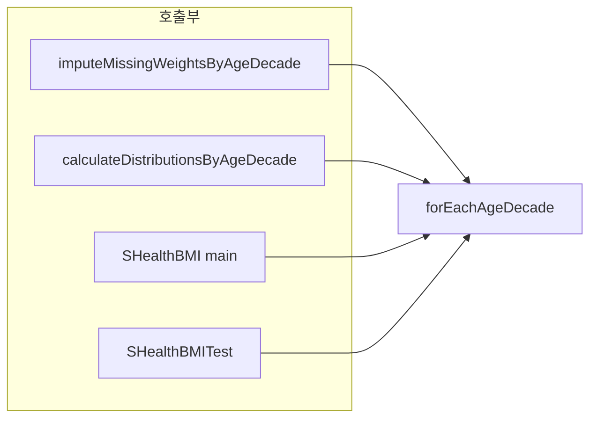

# SHealth_08 — 02-04단계: 반복/중복 제거 리팩토링

> **통합 최종본**: [02_SHealth_08_1차_리팩토링_보고서.md](./02_SHealth_08_1차_리팩토링_보고서.md)  
> **선행 문서**: [02-01단계 — 네이밍 개선](./02-01단계%20—%20네이밍%20개선%20리팩토링.md) · [02-02단계 — 하드코드 및 전역변수 제거](./02-02단계%20—%20하드코드%20및%20전역변수%20제거.md) · [02-03단계 — 함수 추출](./02-03단계%20—%20함수%20추출%20리팩토링.md)

| 항목 | 내용 |
|------|------|
| **프로젝트명** | SHealth BMI (C++) |
| **작성일** | 2026-05-20 |
| **단계** | Activities 2 — 반복/중복 제거 |
| **목적** | 연령대·카테고리 반복 로직 통합, 테스트·경로 처리 중복 제거 |

---

## 1. 개요

### 1.1 작업 범위

02-01~02-03에서 구조·함수 분리가 완료된 뒤, **남아 있던 반복 패턴**을 추가로 제거하였다.

| 항목 | 수행 여부 |
|------|-----------|
| 연령대 `for (20; <=70; +=10)` 루프 통합 | ✅ |
| BMI 카테고리 `switch`·필드 대입 중복 축소 | ✅ |
| `resolveDataFilePath` 공통화 (`main` ↔ 테스트) | ✅ |
| 테스트 데이터 로드 중복 제거 (Fixture) | ✅ |
| `getBmiRatio` 레거시 별칭 유지 | ✅ |
| `sumCategoryPercents` 헬퍼 추가 | ✅ |

### 1.2 적용 제약 조건 (변경 없음)

| 필드 | 규칙 | 구현 |
|------|------|------|
| `id` | 0 이상 | `id >= 0` |
| `age` | 0일 수 없음 | `age > 0` |
| `height` | 0 이상 | `heightCm >= 0.0` |

---

## 2. Before / After

### 2.1 중복 패턴 비교

| 위치 | Before | After |
|------|--------|-------|
| `SHealth.cpp` 체중 보정 | `for (ageDecade = 20; …)` | `forEachAgeDecade([this](int ageDecade) { … })` |
| `SHealth.cpp` 통계 집계 | 동일 `for` 루프 2번째 | `forEachAgeDecade` 재사용 |
| `SHealthBMI.cpp` 출력 | `for (ageDecade = 20; …)` | `SHealth::forEachAgeDecade` |
| 카테고리 건수 집계 | `switch` + 4개 멤버 필드 | `std::array<int,4>` + `bmiCategoryIndex()` |
| 백분율 변환 | 4줄 수동 대입 | `percentFields[]` 루프 |
| 비율 조회 | `getCategoryPercent` 내 `switch` 4갈래 | `percentForCategory()` 헬퍼 |
| 데이터 경로 | `SHealthBMI`·테스트 각각 fallback | `SHealth::resolveDataFilePath()` |
| 테스트 로드 | 3개 TC마다 동일 `loadAndCalculate` + fallback | `SHealthLoadedDataFixture` |
| 비율 합 검증 | 4회 `getCategoryPercent` 합산 | `sumCategoryPercents()` |

### 2.2 코드 규모

| 파일 | 02-03 이후 (줄) | 02-04 이후 (줄) |
|------|-----------------|-----------------|
| `SHealth.h` | 61 | 79 |
| `SHealth.cpp` | 230 | 259 |
| `SHealthBMI.cpp` | 52 | 33 |
| `SHealthBMITest.cpp` | 81 | 71 |

`SHealthBMI.cpp`는 경로 해석을 `SHealth`로 이전하여 **줄 수 감소**. 핵심 로직은 `SHealth`에 집중.

---

## 3. 추가된 API·헬퍼

### 3.1 공개 API (`SHealth.h`)

```cpp
static constexpr std::array<BmiCategory, 4> kAllBmiCategories = { … };

template <typename Callback>
static void forEachAgeDecade(Callback&& callback);

static std::string resolveDataFilePath(const std::string& preferredPath);

double getBmiRatio(int ageDecade, int categoryCode) const;  // 레거시 별칭
double sumCategoryPercents(int ageDecade) const;
```

| API | 역할 |
|-----|------|
| `forEachAgeDecade` | 20~70대 단일 순회 패턴 (템플릿 콜백) |
| `kAllBmiCategories` | 4 BMI 범주 순회용 상수 배열 |
| `resolveDataFilePath` | `shealth.dat` / `../shealth.dat` 탐색 |
| `getBmiRatio` | `getCategoryPercent` 위임 (기존 이름 호환) |
| `sumCategoryPercents` | 연령대별 4범주 비율 합 |

### 3.2 내부 헬퍼 (`SHealth.cpp` 익명 네임스페이스)

```cpp
constexpr size_t bmiCategoryIndex(BmiCategory category);
struct CategoryCounts { std::array<int, 4> byCategory{}; };
void incrementCategoryCount(CategoryCounts& counts, BmiCategory category);
double percentForCategory(const AgeDecadeDistribution& distribution, BmiCategory category);
AgeDecadeDistribution toPercentDistribution(const CategoryCounts& counts, int memberCount);
```

---

## 4. 주요 코드 변경

### 4.1 연령대 루프 통합



**After (`SHealthBMI.cpp`)**:

```cpp
SHealth::forEachAgeDecade([&analyzer](int ageDecade) {
    printAgeDecadeDistribution(analyzer, ageDecade);
});
```

### 4.2 카테고리 집계·조회

**Before**: `CategoryCounts`에 `underweight`, `normal` … 4개 `int` 멤버 + `incrementCategoryCount` `switch`.

**After**:

```cpp
++counts.byCategory[bmiCategoryIndex(category)];
```

백분율 변환도 `percentFields[]` 포인터 배열로 4필드를 루프 처리.

### 4.3 테스트 Fixture

```cpp
class SHealthLoadedDataFixture : public ::testing::Test {
protected:
    void SetUp() override {
        recordCount_ = analyzer_.loadAndCalculate(
            SHealth::resolveDataFilePath("shealth.dat"));
        ASSERT_GT(recordCount_, 0u);
    }
    SHealth analyzer_;
    size_t recordCount_ = 0;
};
```

| 테스트 | Fixture 사용 |
|--------|--------------|
| `LoadSampleDataFile` | ✅ `TEST_F(SHealthLoadedDataFixture, …)` |
| `AgeDecadeDistributionSumsToOneHundred` | ✅ |
| `GetCategoryPercentAcceptsLegacyCategoryCode` | ✅ (+ `getBmiRatio` 검증) |

---

## 5. 검증 결과

### 5.1 빌드·테스트

```bash
cd build
cmake --build .
ctest --output-on-failure
```

**결과: 7/7 Pass**

### 5.2 실행 출력 (변경 없음)

```
20 - underweight = 3.511053, normal = 23.797139, overweight = 11.833550, obesity = 60.858257
...
70 - underweight = 0.529101, normal = 12.345679, overweight = 10.758377, obesity = 76.366843
```

동작·수치는 02-03과 동일 — **리팩토링만** 수행.

---

## 6. 품질 개선 요약

| 평가 항목 | 개선 내용 |
|-----------|-----------|
| DRY | 연령대·카테고리·경로·테스트 로드 중복 제거 |
| 유지보수 | 연령대 범위 변경 시 `forEachAgeDecade` 한 곳만 수정 |
| 테스트 | Fixture로 로드 실패 조기 감지, TC 본문 단순화 |
| 호환성 | `getBmiRatio` 별칭으로 기존 호출 이름 유지 |

---

## 7. 결론

반복/중복 제거 단계에서 **연령대 순회·카테고리 처리·파일 경로·테스트 셋업**의 반복을 공통 API로 통합하였다. 도메인 규칙·실행 결과·단위 테스트는 유지되며, Activities 2(1차 리팩토링)의 마지막 항목을 완료하였다.

다음 단계: Activities 3(테스트 확충) → Activities 4(SRP·기능 추가).

---

*본 문서는 2026-05-20 수행한 반복/중복 제거 리팩토링 결과를 바탕으로 작성되었습니다.*
