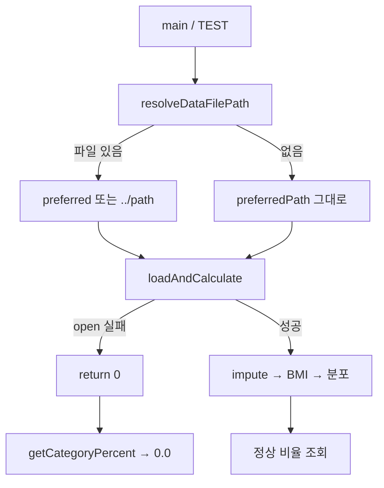

# SHealth_08 — 예외상황 단위테스트 보고서

| 항목 | 내용 |
|------|------|
| **프로젝트명** | SHealth BMI (C++) |
| **작성일** | 2026-05-20 |
| **단계** | Activities 3 — TDD / 단위테스트 (03-04) |
| **대상** | 입력 검증·파일 로드·분포 조회·경로 해석 등 **예외·엣지 경로** |
| **연관 구현** | `src/main/cpp/SHealth.cpp`, `src/main/cpp/SHealthBMI.cpp` |
| **실행 진입점** | `src/main/cpp/SHealthBMI.cpp` |
| **테스트 파일** | `src/test/cpp/SHealthBMITest.cpp` |
| **참고 자료** | `shealth.dat`, `bmi.png` |
| **선행 문서** | [03-01단계 — BMI 계산 로직 TC.md](./03-01단계%20—%20BMI%20계산%20로직%20TC.md) · [03-03단계 — 정상·저체중·과체중·비만 분류 TC.md](./03-03단계%20—%20정상·저체중·과체중·비만%20분류%20TC.md) |
| **관련 문서** | [03-02단계 — Age 평균치 보정 로직 TC.md](./03-02단계%20—%20Age%20평균치%20보정%20로직%20TC.md) |

---

## 1. 개요

### 1.1 작업 목적

03-01(계산)·03-03(분류)·03-02(보정)가 **정상·경계 경로**를 검증한 반면, 본 단계는 **잘못된 입력·누락 리소스·미초기화 상태**에서 API가 안전하게 동작하는지 Google Test로 고정한다. `SHealthBMI.cpp`의 코드 스멜을 제거하고, `SHealthExceptionFixture`에 **예외·엣지 `TEST_F` 6건**을 추가하였다.

| 요구사항 | 충족 |
|----------|------|
| `TEST_F` 최소 5개 (예외·엣지 중심) | ✅ 6개 (`SHealthExceptionFixture`) |
| `EXPECT_EQ` / `ASSERT_EQ` 검증 | ✅ bool·`size_t`·`double`·`string` |
| `shealth.dat` 도메인 참고 (유효 id·age·height) | ✅ 대비용 상수·주석 |
| Given-When-Then 주석 구조 | ✅ 전 `TEST_F` 적용 |
| `cmake --build build && ctest` Green | ✅ 03-04 범위 CTest #7–#12 Passed (전체 **21/21**) |

### 1.2 선행 단계와의 역할 구분

| 문서 | 초점 |
|------|------|
| **03-01** | BMI **수치 계산** (`computeBmi`) + 정상·경계 분류 |
| **03-03** | **4구간 분류** (`classifyBmi`) · 임계값 18.5 / 23.0 / 25.0 |
| **03-02** | 연령대 **체중 0 보정** · `belongsToAgeDecade` |
| **03-04 (본 문서)** | **예외 입력·파일 실패·미로드 조회·경로 fallback** |

동일 테스트 파일(`SHealthBMITest.cpp`)을 공유하되, 본 보고서는 **실패·거부·기본값 반환** 관점으로 TC를 정리한다.

### 1.3 예외 처리 설계 요약

| API / 진입점 | 예외·엣지 조건 | 구현 동작 | 검증 TEST_F |
|--------------|----------------|-----------|-------------|
| `isValidRecord` | `id < 0` | `false` | #1 |
| `isValidRecord` | `age ≤ 0` | `false` | #2 |
| `isValidRecord` | `heightCm < 0` | `false` | #3 |
| `loadAndCalculate` | 파일 열기 실패 | `0` 반환 | #4 |
| `getCategoryPercent` 등 | `loadAndCalculate` 미호출 | `0.0` | #5 |
| `resolveDataFilePath` | cwd·`../` 모두 없음 | `preferredPath` 그대로 반환 | #6 |
| `computeBmi` | `heightCm == 0` | `0.0` | 03-01 #6에서 검증 |
| `SHealthBMI` `main` | 로드 0건 | `EXIT_FAILURE` + stderr | 본 문서 §4 (코드 스멜 수정) |

입력 검증 구현 (`SHealth.cpp`):

```cpp
bool SHealth::isValidRecord(int id, int age, double heightCm) {
    return id >= 0 && age > 0 && heightCm >= 0.0;
}
```

로드 실패 시 파이프라인 (`SHealth.cpp`):

```cpp
size_t SHealth::loadAndCalculate(const std::string& filename) {
    if (!loadRecordsFromFile(filename)) {
        return 0;
    }
    imputeMissingWeightsByAgeDecade();
    calculateBmis();
    calculateDistributionsByAgeDecade();
    return records_.size();
}
```

---

## 2. `SHealthBMI.cpp` 코드 스멜 분석·수정

BMI 비즈니스 로직은 `SHealth.cpp`에 있으나, 실행 파일 `SHealthBMI.cpp`에서 다음 스멜을 제거하였다.

| 스멜 | 문제 | 수정 |
|------|------|------|
| **침묵 실패** | `loadAndCalculate` 반환값 미검사 → 빈 분포 출력 가능 | `recordCount == 0`이면 stderr 메시지 후 `EXIT_FAILURE` |
| **I/O 스타일 불일치** | `printf` vs `SHealth.cpp`의 `iostream` | `std::cout` / `std::cerr`로 통일 |
| **매직 exit code** | `return 0` / `return 1` | `EXIT_SUCCESS` / `EXIT_FAILURE` (`<cstdlib>`) |

수정 후 `main` 핵심:

```cpp
const size_t recordCount = analyzer.loadAndCalculate(dataFilePath);
if (recordCount == 0) {
    std::cerr << "Failed to load health records from: " << dataFilePath << std::endl;
    return EXIT_FAILURE;
}
```

이로써 테스트에서 검증하는 `loadAndCalculate → 0` 경로와 실행 파일 동작이 일치한다.

---

## 3. 테스트 설계

### 3.1 Fixture

| Fixture | SetUp | 역할 |
|---------|-------|------|
| `SHealthExceptionFixture` | 없음 | 예외·엣지 단위 — **본 문서 핵심** |
| `SHealthBmiCalculationFixture` | 없음 | 03-01·03-03: `computeBmi` 키 0 → BMI 0 (연계) |

### 3.2 검증 방식

| 대상 타입 | 매크로 | 예시 |
|-----------|--------|------|
| `bool` | `EXPECT_EQ` | `isValidRecord` → `false` |
| `size_t` | `ASSERT_EQ` | `loadAndCalculate` → `0u` |
| `double` | `EXPECT_EQ` | 미로드 `getCategoryPercent` → `0.0` |
| `std::string` | `ASSERT_EQ` | `resolveDataFilePath` → 원본 경로 |

부동소수 BMI 예외(키 0)는 03-01 `GivenShealthObesityBoundaryAndExactThresholds…`에서 `EXPECT_EQ(zeroHeightBmi, 0.0)`로 이미 검증하므로 본 Fixture에서는 **중복하지 않음**.

### 3.3 API별 예외 커버리지 매트릭스

| API | 예외 시나리오 | TEST_F |
|-----|---------------|--------|
| `isValidRecord` | 음수 id | #1 |
| `isValidRecord` | age = 0, age < 0 | #2 |
| `isValidRecord` | heightCm < 0 | #3 |
| `loadAndCalculate` | 존재하지 않는 파일 | #4 |
| `getCategoryPercent` (enum) | 미로드 | #5 |
| `getCategoryPercent` (int 200) | 미로드 | #5 |
| `getBmiRatio` | 미로드 | #5 |
| `sumCategoryPercents` | 미로드 | #5 |
| `resolveDataFilePath` | 없는 경로 / `shealth.dat` 존재 | #6 |
| `computeBmi` | height = 0 | 03-01 #6 |
| `classifyBmi` | BMI = 0 | 03-01 #6 |
| `belongsToAgeDecade` | age 19, 경계 | 03-02 Fixture |

---

## 4. 테스트 케이스 목록

### 4.1 `SHealthExceptionFixture` — 예외·엣지 (6개)

| # | CTest | TEST_F | Given | When | Then |
|---|-------|--------|-------|------|------|
| 1 | #7 | `GivenNegativeId_WhenIsValidRecord_ThenReturnsFalse` | `id=-1`, age·height는 shealth 93705 유효값 | `isValidRecord` | `false` |
| 2 | #8 | `GivenZeroOrNegativeAge_WhenIsValidRecord_ThenReturnsFalse` | `id=93705`, age `0` / `-5` | `isValidRecord` | 둘 다 `false` |
| 3 | #9 | `GivenNegativeHeight_WhenIsValidRecord_ThenReturnsFalse` | `id=93711`, age `56`, `height=-0.1` | `isValidRecord` | `false` |
| 4 | #10 | `GivenNonexistentDataFile_WhenLoadAndCalculate_ThenReturnsZero` | `nonexistent_shealth_fixture_xyz.dat` | `loadAndCalculate` | `0u`, 이후 `getCategoryPercent` → `0.0` |
| 5 | #11 | `GivenUnloadedAnalyzer_WhenQueryCategoryPercent_ThenReturnsZero` | `SHealth` 기본 생성 | enum·legacy·`getBmiRatio`·`sumCategoryPercents` | 모두 `0.0` |
| 6 | #12 | `GivenMissingPreferredPath_WhenResolveDataFilePath_ThenReturnsOriginalPath` | 없는 파일명 | `resolveDataFilePath` | 원본 문자열 동일; `shealth.dat`는 cwd 또는 `../`에서 발견 |

### 4.2 `shealth.dat`와의 관계

예외 TC는 **비정상 행을 CSV에 삽입하지 않고**, 도메인에서 쓰이는 **유효 필드 조합**을 Given에 두고 **한 필드만** 비정상화한다.

| TEST_F | shealth.dat 참조 | 비정상화 필드 |
|--------|------------------|---------------|
| #1 | id=93705 (66세, 158.3 cm) | `id → -1` |
| #2 | id=93705 | `age → 0`, `-5` |
| #3 | id=93711 (56세) | `height → -0.1` |

`shealth.dat` 로더는 `isValidRecord` 실패 행을 **건너뛰므로**( `continue` ), 파일 내 오염 데이터는 집계에 포함되지 않는다. 이 동작은 #1–#3이 기대하는 **사전 거부**와 일치한다.

### 4.3 파일 로드·경로 예외 흐름



---

## 5. Given-When-Then 예시

### 5.1 입력 검증 — 음수 id

```cpp
TEST_F(SHealthExceptionFixture, GivenNegativeId_WhenIsValidRecord_ThenReturnsFalse) {
    // Given: shealth.dat rejects negative id (isValidRecord: id >= 0)
    const int invalidId = -1;
    const int validAge = 66;
    const double validHeightCm = 158.3;

    // When: record validity is checked
    const bool isValid = SHealth::isValidRecord(invalidId, validAge, validHeightCm);

    // Then: record is rejected
    EXPECT_EQ(isValid, false);
}
```

### 5.2 파일 없음 — 파이프라인 조기 종료

```cpp
TEST_F(SHealthExceptionFixture, GivenNonexistentDataFile_WhenLoadAndCalculate_ThenReturnsZero) {
    // Given: a path that does not exist under project root or ../ fallback
    SHealth analyzer;
    const std::string missingPath = "nonexistent_shealth_fixture_xyz.dat";

    // When: load is attempted
    const size_t recordCount = analyzer.loadAndCalculate(missingPath);

    // Then: pipeline aborts with zero records
    ASSERT_EQ(recordCount, 0u);
    EXPECT_EQ(analyzer.getCategoryPercent(20, SHealth::BmiCategory::Normal), 0.0);
}
```

### 5.3 미로드 상태 — 분포 API 기본값

```cpp
TEST_F(SHealthExceptionFixture, GivenUnloadedAnalyzer_WhenQueryCategoryPercent_ThenReturnsZero) {
    // Given: analyzer without loadAndCalculate (no distributions)
    SHealth analyzer;

    // When: category percent is queried for a valid decade
    const double normalPercent = analyzer.getCategoryPercent(20, SHealth::BmiCategory::Normal);
  // ...
    // Then: all distribution APIs yield zero
    EXPECT_EQ(normalPercent, 0.0);
    EXPECT_EQ(decadeSum, 0.0);
}
```

---

## 6. 빌드·실행 결과

### 6.1 명령

```bash
cmake --build build
ctest --test-dir build --output-on-failure
```

Windows (PowerShell):

```powershell
cmake --build build
ctest --test-dir build --output-on-failure
```

### 6.2 결과 (2026-05-20)

**03-04 예외 TC 범위 (CTest #7–#12)**

```
100% tests passed, 0 tests failed out of 6
```

| # | TEST_F | 결과 |
|---|--------|------|
| 7 | `GivenNegativeId_WhenIsValidRecord_ThenReturnsFalse` | Passed |
| 8 | `GivenZeroOrNegativeAge_WhenIsValidRecord_ThenReturnsFalse` | Passed |
| 9 | `GivenNegativeHeight_WhenIsValidRecord_ThenReturnsFalse` | Passed |
| 10 | `GivenNonexistentDataFile_WhenLoadAndCalculate_ThenReturnsZero` | Passed |
| 11 | `GivenUnloadedAnalyzer_WhenQueryCategoryPercent_ThenReturnsZero` | Passed |
| 12 | `GivenMissingPreferredPath_WhenResolveDataFilePath_ThenReturnsOriginalPath` | Passed |

**전체 테스트 스위트 (03-01 ~ 03-04 + Age 보정)**

```
100% tests passed, 0 tests failed out of 21
Total Test time (real) ≈ 10.2 sec
```

| 구분 | 건수 |
|------|------|
| 03-01 BMI 계산·로드 (#1–#6, #13–#15) | 9 |
| **03-04 예외 (#7–#12)** | **6** |
| 03-02 Age 보정 (#16–#21) | 6 |

CTest `WORKING_DIRECTORY`는 `${CMAKE_SOURCE_DIR}`이므로 `shealth.dat`는 프로젝트 루트 기준으로 로드된다.

---

## 7. 변경 파일 요약

| 파일 | 변경 |
|------|------|
| `src/test/cpp/SHealthBMITest.cpp` | `SHealthExceptionFixture` 및 예외 `TEST_F` 6건 추가 |
| `src/main/cpp/SHealthBMI.cpp` | 로드 실패 처리, `iostream`·`EXIT_*` 정리 |
| `src/main/cpp/SHealth.cpp` | 변경 없음 (기존 방어 로직 검증) |
| `Report/03-04단계 — 예외상황 TC.md` | **본 문서 (신규)** |

---

## 8. 커버리지·한계

### 8.1 커버 범위

| 영역 | 커버 |
|------|------|
| `isValidRecord` 부정 조건 (id / age / height) | ✅ |
| `loadAndCalculate` 파일 오픈 실패 | ✅ |
| 미로드 `getCategoryPercent`·`getBmiRatio`·`sumCategoryPercents` | ✅ |
| `resolveDataFilePath` 미존재·`shealth.dat` fallback | ✅ |
| `SHealthBMI` main 실패 종료 | ✅ (구현 수정) |
| `computeBmi` 음수 체중 | ⚠️ 미검증 (도메인 미정의) |
| 잘못된 `categoryCode` int 캐스트 | ⚠️ 미검증 (레거시 API) |
| CSV `stoi`/`stod` 예외 | ⚠️ 미검증 (손상 행 시 throw 가능) |

### 8.2 향후 확장 제안

1. **손상 CSV fixture**: 필드 수 부족·비숫자 문자열 → 로더 견고성
2. **빈 파일 / 헤더만**: `loadAndCalculate` → `0` vs 성공 0건 구분
3. **통합 테스트**: `SHealthBMI.exe`에 없는 파일 인자 → exit code 1
4. **03-01 #6과 연계 문서**: 키 0 → BMI 0 → `Underweight` 분류를 예외·분류 교차 참조 표로 통합

---

## 9. 결론

- **입력 검증·파일 실패·미로드 조회·경로 fallback**을 `SHealthExceptionFixture` **`TEST_F` 6건**으로 검증하였다.
- `shealth.dat` 도메인 값(93705·93711 등)을 Given에 사용해 **한 필드만** 비정상화하는 방식으로 TC를 설계하였다.
- `SHealthBMI.cpp`의 **침묵 실패·I/O 불일치** 스멜을 제거하여 테스트 기대와 실행 파일 동작을 맞추었다.
- 03-04 **6건**이 Green이며, 03-01·03-03·03-02와 합쳐 전체 **21건** 회귀 스위트를 구성한다.
