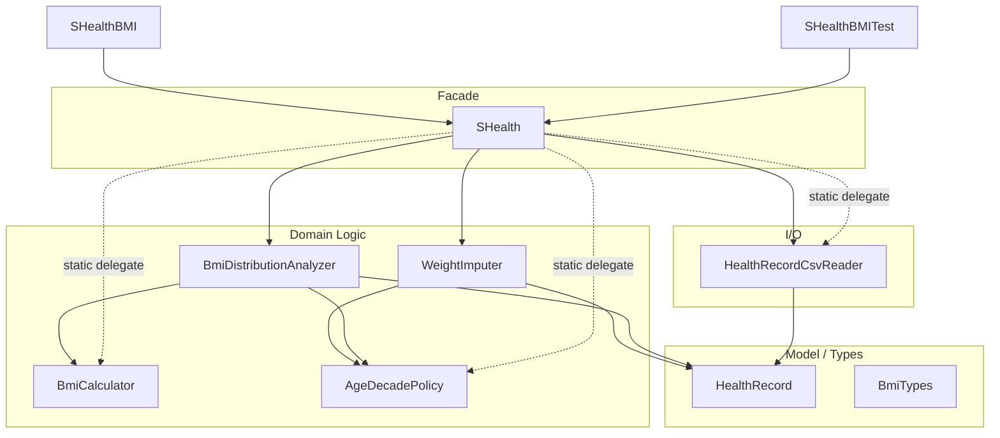

# SHealth_08 — SRP 기반 책임 분리 리팩토링 보고서

| 항목 | 내용 |
|------|------|
| **프로젝트명** | SHealth BMI (C++) |
| **작성일** | 2026-05-20 |
| **단계** | Activities 4 — SRP 리팩토링 (04-01) |
| **대상** | `SHealth` God 클래스 → 책임별 협력 클래스 + Facade |
| **표준** | C++17 |
| **선행 문서** | [02_리팩토링 통합보고서.md](./02_리팩토링%20통합보고서.md) · [03-01](./03-01단계%20—%20BMI%20계산%20로직%20TC.md) · [03-02](./03-02단계%20—%20Age%20평균치%20보정%20로직%20TC.md) · [03-03](./03-03단계%20—%20정상·저체중·과체중·비만%20분류%20TC.md) · [03-04](./03-04단계%20—%20예외상황%20TC.md) |
| **참고 자료** | `bmi.png`, `shealth.dat`, `README.md` Activities 4 |

---

## 1. 개요

### 1.1 작업 목적

Activities **2단계**(클린코드 1차 리팩토링)와 **3단계**(Google Test) 이후, `SHealth` 클래스가 담당하던 **6가지 이상의 책임**을 **단일 책임 원칙(SRP)**에 맞게 분리하였다. 외부 호출부(`SHealthBMI.cpp`, `SHealthBMITest.cpp`)는 **기존 public API를 유지**하는 Facade 패턴으로 호환성을 보장한다.

| 요구사항 | 충족 |
|----------|------|
| `HealthRecord`, `BmiCalculator`, `AgeDecadePolicy` 등 7개 역할 분리 | ✅ |
| `loadAndCalculate`, `getCategoryPercent`, `getBmiRatio`, `sumCategoryPercents` API 유지 | ✅ |
| 정적 API (`computeBmi`, `classifyBmi`, `belongsToAgeDecade` 등) 유지 | ✅ |
| C++17, 과도한 인터페이스·추상화 없음 | ✅ |
| 기존 Google Test **21/21** Green | ✅ |
| `CMakeLists.txt` 최소 수정 | ✅ |

### 1.2 리팩토링 전 `SHealth`가 가진 책임 (Before)

| # | 책임 | Before 구현 위치 |
|---|------|------------------|
| 1 | CSV 파일 읽기·파싱 | `loadRecordsFromFile`, `splitCsvLine` |
| 2 | 입력 데이터 검증 | `isValidRecord` |
| 3 | 데이터 파일 경로 해석 | `resolveDataFilePath` |
| 4 | 나이대별 체중 평균 보정 | `imputeMissingWeightsByAgeDecade`, `averageWeightForDecade` |
| 5 | BMI 계산·범주 분류 | `computeBmi`, `classifyBmi`, `calculateBmis` |
| 6 | 나이대 판정·순회 | `belongsToAgeDecade`, `forEachAgeDecade` |
| 7 | 나이대별 BMI 분포 통계 | `computeDistributionForDecade`, `calculateDistributionsByAgeDecade` |
| 8 | 레거시 조회 API | `getCategoryPercent`, `getBmiRatio`, `sumCategoryPercents` |

> 단일 클래스(`SHealth.h` 79줄, `SHealth.cpp` 259줄)에 위 책임이 모두 집중되어 있었다.

### 1.3 분리 후 클래스 구조 (After)



---

## 2. 클래스별 책임

| 클래스 | 파일 | 책임 | public API 요약 |
|--------|------|------|-----------------|
| **HealthRecord** | `HealthRecord.h` | 사용자 건강 데이터 모델 | struct: `id`, `age`, `weightKg`, `heightCm`, `bmi` |
| **BmiTypes** | `BmiTypes.h` | 공통 타입·상수 | `BmiCategory`, `AgeDecadeDistribution`, `kAllBmiCategories` |
| **BmiCalculator** | `BmiCalculator.h/.cpp` | BMI 산출·4구간 분류 | `computeBmi`, `classifyBmi` |
| **AgeDecadePolicy** | `AgeDecadePolicy.h/.cpp` | 나이대 상수·소속·순회 | `kMin/MaxAgeDecade`, `belongsToAgeDecade`, `forEachAgeDecade` |
| **HealthRecordCsvReader** | `HealthRecordCsvReader.h/.cpp` | CSV 로딩·검증·경로 | `loadFromFile`, `isValidRecord`, `resolveDataFilePath` |
| **WeightImputer** | `WeightImputer.h/.cpp` | 나이대 평균 체중 보정 | `imputeMissingWeights` |
| **BmiDistributionAnalyzer** | `BmiDistributionAnalyzer.h/.cpp` | BMI 일괄 계산·분포 집계 | `calculateBmis`, `computeDistributionsByAgeDecade`, `percentForCategory` |
| **SHealth** | `SHealth.h/.cpp` | Facade·파이프라인 조율·레거시 API | 기존 public API 전부 |

### 2.1 의존 관계 (include)

```
SHealth.h
  ├── AgeDecadePolicy.h
  ├── BmiTypes.h
  └── HealthRecord.h

SHealth.cpp
  ├── BmiCalculator.h
  ├── BmiDistributionAnalyzer.h
  ├── HealthRecordCsvReader.h
  └── WeightImputer.h

WeightImputer.cpp → AgeDecadePolicy.h
BmiDistributionAnalyzer.cpp → AgeDecadePolicy.h, BmiCalculator.h
HealthRecordCsvReader.cpp → HealthRecord.h
```

순환 의존 없음. Facade(`SHealth`)만 여러 하위 컴포넌트를 조합한다.

---

## 3. Before / After 비교

### 3.1 구조

| 구분 | Before (03단계 완료 시점) | After (04-01) |
|------|---------------------------|---------------|
| 핵심 클래스 수 | 1 (`SHealth`) | 8 (모델·타입·도메인·I/O·Facade) |
| `SHealth.h` | 79줄 (enum·struct·private 메서드 포함) | 44줄 (Facade + type alias) |
| `SHealth.cpp` | 259줄 | 62줄 (위임·파이프라인만) |
| BMI 계산·분류 | `SHealth::` static | `BmiCalculator::` |
| CSV 로딩 | `SHealth::loadRecordsFromFile` (private) | `HealthRecordCsvReader::loadFromFile` |
| 체중 보정 | `SHealth::imputeMissingWeightsByAgeDecade` | `WeightImputer::imputeMissingWeights` |
| 분포 집계 | `SHealth::computeDistributionForDecade` 등 | `BmiDistributionAnalyzer::` |
| 테스트 변경 | — | **없음** (`SHealth::` API 그대로) |

### 3.2 코드 규모 (줄 수)

| 파일 | 줄 수 | 비고 |
|------|-------|------|
| `SHealth.h` | 44 | Facade |
| `SHealth.cpp` | 62 | 파이프라인 4단계 |
| `BmiTypes.h` | 24 | |
| `HealthRecord.h` | 9 | |
| `BmiCalculator.h` / `.cpp` | 14 / 28 | |
| `AgeDecadePolicy.h` / `.cpp` | 17 / 5 | |
| `HealthRecordCsvReader.h` / `.cpp` | 16 / 72 | |
| `WeightImputer.h` / `.cpp` | 13 / 37 | |
| `BmiDistributionAnalyzer.h` / `.cpp` | 20 / 103 | |
| **합계 (신규+축소)** | **약 435줄** | 단일 파일 338줄 → 역할별 분산 |

> 전체 줄 수는 늘었으나 **파일당 최대 복잡도**는 낮아지고, 변경 시 영향 범위가 클래스 단위로 한정된다.

---

## 4. 리팩토링 진행 순서

요청된 단계별 순서로 적용하였다.

| 순서 | 작업 | 결과 클래스 |
|------|------|-------------|
| 1 | 모델·순수 계산 로직 분리 | `HealthRecord`, `BmiTypes`, `BmiCalculator`, `AgeDecadePolicy` |
| 2 | CSV 로딩 책임 분리 | `HealthRecordCsvReader` |
| 3 | 체중 보정 책임 분리 | `WeightImputer` |
| 4 | 분포 계산 책임 분리 | `BmiDistributionAnalyzer` |
| 5 | `SHealth` Facade 축소 | `SHealth` — 조율·조회·static 위임만 |
| 6 | 테스트 실행·보정 | 수정 불필요, **21/21** 즉시 Green |

### 4.1 Facade 파이프라인 (`loadAndCalculate`)

```cpp
size_t SHealth::loadAndCalculate(const std::string& filename) {
    if (!HealthRecordCsvReader::loadFromFile(filename, records_)) {
        return 0;
    }
    WeightImputer::imputeMissingWeights(records_);
    BmiDistributionAnalyzer::calculateBmis(records_);
    distributionsByDecade_ = BmiDistributionAnalyzer::computeDistributionsByAgeDecade(records_);
    return records_.size();
}
```

**Before**와 동일한 4단계 순서: 로드 → 보정 → BMI 계산 → 분포 집계.

### 4.2 외부 API 호환 (Facade 위임)

| 기존 `SHealth` API | 위임 대상 |
|--------------------|-----------|
| `computeBmi` | `BmiCalculator::computeBmi` |
| `classifyBmi` | `BmiCalculator::classifyBmi` |
| `belongsToAgeDecade` | `AgeDecadePolicy::belongsToAgeDecade` |
| `forEachAgeDecade` | `AgeDecadePolicy::forEachAgeDecade` |
| `isValidRecord` | `HealthRecordCsvReader::isValidRecord` |
| `resolveDataFilePath` | `HealthRecordCsvReader::resolveDataFilePath` |
| `getCategoryPercent` / `getBmiRatio` / `sumCategoryPercents` | 내부 `distributionsByDecade_` + `BmiDistributionAnalyzer::percentForCategory` |

타입 alias로 테스트·main 코드 변경 없이 유지:

```cpp
using BmiCategory = ::BmiCategory;
using HealthRecord = ::HealthRecord;
using AgeDecadeDistribution = ::AgeDecadeDistribution;
static constexpr std::array<BmiCategory, 4> kAllBmiCategories = ::kAllBmiCategories;
```

---

## 5. 핵심 설계 결정

### 5.1 채택한 패턴

| 패턴 | 적용 |
|------|------|
| **Facade** | `SHealth` — 외부에는 기존 단일 클래스처럼 보임 |
| **Plain struct** | `HealthRecord` — 데이터 전달 객체, 행위 없음 |
| **Static utility class** | `BmiCalculator`, `AgeDecadePolicy` 등 — 상태 없는 도메인 함수 묶음 |

### 5.2 의도적으로 하지 않은 것

| 항목 | 사유 |
|------|------|
| `IBmiCalculator` 등 인터페이스 | 요구사항: 과도한 추상화 금지, 단일 구현만 존재 |
| DI 컨테이너 | 규모·복잡도 대비 이득 없음 |
| `SHealthBMITest.cpp` 수정 | Facade로 API 동일 → 회귀 테스트가 곧 검증 |

### 5.3 `BmiTypes.h` 분리 이유

`BmiCategory`, `AgeDecadeDistribution`을 `SHealth` 중첩 타입에서 **전역(번역 단위) 타입**으로 승격하고, `SHealth`에서는 `using`으로 재노출한다. 여러 클래스가 동일 타입을 공유하면서 `SHealth`에 대한 역방향 의존을 제거한다.

---

## 6. 변경 파일 목록

### 6.1 신규 추가

| 파일 | 역할 |
|------|------|
| `src/main/cpp/BmiTypes.h` | 공통 enum·struct |
| `src/main/cpp/HealthRecord.h` | 레코드 모델 |
| `src/main/cpp/BmiCalculator.h` / `.cpp` | BMI 계산·분류 |
| `src/main/cpp/AgeDecadePolicy.h` / `.cpp` | 나이대 정책 |
| `src/main/cpp/HealthRecordCsvReader.h` / `.cpp` | CSV I/O |
| `src/main/cpp/WeightImputer.h` / `.cpp` | 체중 보정 |
| `src/main/cpp/BmiDistributionAnalyzer.h` / `.cpp` | 분포 분석 |

### 6.2 수정

| 파일 | 변경 내용 |
|------|-----------|
| `src/main/cpp/SHealth.h` | Facade·type alias, private 구현 제거 |
| `src/main/cpp/SHealth.cpp` | 위임·파이프라인만 유지 |
| `CMakeLists.txt` | `shealth_lib`에 `.cpp` 5개 추가 |

### 6.3 변경 없음

| 파일 | 비고 |
|------|------|
| `src/main/cpp/SHealthBMI.cpp` | `SHealth::` API 그대로 사용 |
| `src/test/cpp/SHealthBMITest.cpp` | 21개 `TEST_F` 변경 없음 |
| `shealth.dat` | 데이터 동일 |

---

## 7. 빌드·테스트 결과

### 7.1 명령

```powershell
cd build
cmake ..
cmake --build .
ctest --output-on-failure
```

### 7.2 결과 (2026-05-20)

**단위·통합 테스트**

```
100% tests passed, 0 tests failed out of 21
Total Test time (real) ≈ 11.5 sec
```

| 구간 | Fixture 수 | 내용 |
|------|-------------|------|
| 03-01 BMI 계산 | 6 + 3 Loaded | milli-BMI, 분류, 실데이터 |
| 03-02 Age 보정 | 6 | `belongsToAgeDecade`, imputation CSV |
| 03-04 예외 | 6 | 검증, 파일 실패, 미로드 조회 |

**실행 파일 (`SHealthBMI.exe`)**

```
20 - underweight = 3.51105, normal = 23.7971, ...
...
70 - underweight = 0.529101, normal = 12.3457, ...
```

리팩토링 전후 **연령대별 출력 수치 동일** (동작 회귀 없음).

---

## 8. SRP 준수 점검

| 클래스 | 변경 이유 (단일 책임) | 변경 시 영향 범위 |
|--------|----------------------|-------------------|
| `HealthRecord` | 데이터 필드만 | 모델 필드 추가 시 |
| `BmiCalculator` | BMI 수식·임계값만 | 분류 기준 변경 시 |
| `AgeDecadePolicy` | 나이대 규칙만 | 10년 단위·범위 변경 시 |
| `HealthRecordCsvReader` | 파일 I/O·CSV만 | 포맷·경로 정책 변경 시 |
| `WeightImputer` | 0kg 보정만 | 평균 산출 규칙 변경 시 |
| `BmiDistributionAnalyzer` | 집계·비율만 | 통계 방식 변경 시 |
| `SHealth` | 조율·조회 API만 | Facade 계약·파이프라인 순서 |

---

## 9. 한계·향후 개선

| 항목 | 현재 상태 | 제안 |
|------|-----------|------|
| 컴포넌트 단위 테스트 | `SHealth` 경유 통합 테스트만 존재 | `BmiCalculator`, `WeightImputer` 직접 `TEST_F` 추가 |
| CSV 파싱 예외 | `stoi`/`stod` 실패 시 예외 전파 | 잘못된 행 skip + 로그 정책 명시 |
| `resolveDataFilePath` | Reader에 위치, Facade가 위임 | 필요 시 `DataFileLocator`로 분리 |
| Activities 4 잔여 | Height=0 보정, 정상 BMI 목록, 전체 비율 API | 별도 04-02 이후 단계 |
| 빌드 산출물 | `build/` 미추적 권장 | `.gitignore`에 `build/` 추가 |

---

## 10. 결론

- `SHealth` God 클래스를 **8개 협력 단위**로 분리하고, `SHealth`는 **Facade**로 축소하였다.
- **기존 public API·테스트·실행 결과**를 유지한 채 SRP·DRY·의미 있는 네이밍을 강화하였다.
- **21/21** Google Test Green으로 03단계 전 범위 회귀 검증을 완료하였다.
- 다음 단계(04-02~)에서는 컴포넌트 단위 테스트 보강 및 README Activities 4 잔여 기능(Height 보정, 목록 API 등) 구현을 권장한다.
