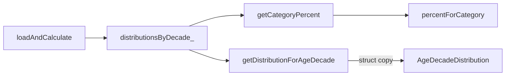

# SHealth_08 — 특정 연령대 BMI 분포 비율 일괄 조회 기능 추가 보고서

| 항목 | 내용 |
|------|------|
| **프로젝트명** | SHealth BMI (C++) |
| **작성일** | 2026-05-20 |
| **단계** | Activities 4 — 기능 추가 (04-02) |
| **대상** | `SHealth::getDistributionForAgeDecade` 신규 API |
| **표준** | C++17 |
| **선행 문서** | [04-01단계 SRP에 따른 책임 분리등 리팩토링.md](./04-01단계%20SRP에%20따른%20책임%20분리등%20리팩토링.md) |
| **관련 문서** | [03-03단계 — 정상·저체중·과체중·비만 분류 TC.md](./03-03단계%20—%20정상·저체중·과체중·비만%20분류%20TC.md) · [03-04단계 — 예외상황 TC.md](./03-04단계%20—%20예외상황%20TC.md) |
| **참고 자료** | `bmi.png`, `shealth.dat`, `README.md` |
| **변경 파일** | `SHealth.h`, `SHealth.cpp`, `SHealthBMITest.cpp` |

---

## 1. 개요

### 1.1 작업 목적

04-01 SRP 리팩토링 이후, **특정 연령대(나이대)의 BMI 4범주 분포 비율**을 한 번의 호출로 조회할 수 있는 API를 추가한다. 기존에는 `getCategoryPercent(ageDecade, category)`를 범주마다 4회 호출해야 했으나, 본 기능으로 `AgeDecadeDistribution` 구조체 전체를 반환한다.

| 요구사항 | 충족 |
|----------|------|
| `getDistributionForAgeDecade(int ageDecade)` 추가 | ✅ |
| 반환값에 `underweightPercent`, `normalPercent`, `overweightPercent`, `obesityPercent` 포함 | ✅ |
| 기존 `AgeDecadeDistribution` 구조체 재사용 | ✅ (`BmiTypes.h`) |
| `getCategoryPercent()` 동작 유지 | ✅ |
| 없는·미계산 연령대 → 전 필드 `0.0` | ✅ |
| `distributionsByDecade_` 재활용, 중복 계산 없음 | ✅ |
| 기존 Google Test 통과 + 신규 TC | ✅ **24/24** Green |

### 1.2 Before / After (조회 방식)

| 구분 | Before (04-01) | After (04-02) |
|------|----------------|---------------|
| 50대 4범주 조회 | `getCategoryPercent(50, …)` × 4 | `getDistributionForAgeDecade(50)` 1회 |
| 반환 타입 | `double` (범주당) | `AgeDecadeDistribution` |
| 데이터 소스 | `distributionsByDecade_` | 동일 (맵 조회만) |
| 재계산 | 없음 | 없음 |

### 1.3 BMI 4범주 (`bmi.png` · README)


| 구간 (한글) | 영문 enum | 필드명 | README 조건 |
|-------------|-----------|--------|-------------|
| 저체중 | `Underweight` | `underweightPercent` | BMI ≤ 18.5 |
| 정상 | `Normal` | `normalPercent` | 18.5 초과 ~ 23 미만 |
| 과체중 | `Overweight` | `overweightPercent` | 23 이상 ~ 25 미만 |
| 비만 | `Obesity` | `obesityPercent` | BMI ≥ 25 |

연령대 키: **20, 30, 40, 50, 60, 70** (`AgeDecadePolicy::forEachAgeDecade`, 10년 단위).

---

## 2. 추가된 public API

### 2.1 선언 (`SHealth.h`)

```cpp
AgeDecadeDistribution getDistributionForAgeDecade(int ageDecade) const;
```

### 2.2 반환 구조체 (`BmiTypes.h`)

```cpp
struct AgeDecadeDistribution {
    double underweightPercent = 0.0;
    double normalPercent = 0.0;
    double overweightPercent = 0.0;
    double obesityPercent = 0.0;
};
```

`SHealth`에서는 `using AgeDecadeDistribution = ::AgeDecadeDistribution;`으로 기존과 동일하게 노출한다.

### 2.3 사용 예

```cpp
SHealth analyzer;
analyzer.loadAndCalculate(SHealth::resolveDataFilePath("shealth.dat"));

SHealth::AgeDecadeDistribution distribution =
    analyzer.getDistributionForAgeDecade(50);

// distribution.underweightPercent
// distribution.normalPercent
// distribution.overweightPercent
// distribution.obesityPercent
```

입력 `50`은 **50대(나이 50~59세)** 를 의미하는 **연령대 키**이며, 실제 나이 값이 아니다.

---

## 3. 구현 방식

### 3.1 구현 코드 (`SHealth.cpp`)

```cpp
SHealth::AgeDecadeDistribution SHealth::getDistributionForAgeDecade(int ageDecade) const {
    const auto distributionIt = distributionsByDecade_.find(ageDecade);
    if (distributionIt == distributionsByDecade_.end()) {
        return AgeDecadeDistribution{};
    }
    return distributionIt->second;
}
```

### 3.2 데이터 흐름



| 단계 | 설명 |
|------|------|
| `loadAndCalculate` | `BmiDistributionAnalyzer::computeDistributionsByAgeDecade`가 20~70 각 연령대 분포를 맵에 저장 |
| `getDistributionForAgeDecade` | 맵에서 `ageDecade` 키 조회 → 있으면 `AgeDecadeDistribution` 복사 반환 |
| 미존재 키 | `AgeDecadeDistribution{}` 기본값 → 네 필드 모두 `0.0` |
| `getCategoryPercent` | 동일 맵 + `percentForCategory` — **변경 없음** |

### 3.3 0.0 반환이 되는 경우

| 상황 | `getDistributionForAgeDecade` | `getCategoryPercent` |
|------|------------------------------|----------------------|
| `loadAndCalculate` 미호출 | 전 필드 `0.0` | `0.0` |
| 잘못된 연령대 키 (예: 25, 80) | 전 필드 `0.0` | `0.0` |
| 유효 연령대·데이터 로드 후 | 집계된 비율 | 동일 비율 |

> `computeDistributionsByAgeDecade`는 유효 연령대(20~70)마다 항목을 생성하며, 멤버가 없는 연령대도 **네 필드 0.0**인 `AgeDecadeDistribution`이 맵에 들어간다. 잘못된 키만 맵에 없어 기본 구조체가 반환된다.

### 3.4 기존 API와의 일관성

| API | 역할 |
|-----|------|
| `getCategoryPercent(ageDecade, category)` | 단일 범주 비율 |
| `getBmiRatio(ageDecade, categoryCode)` | 레거시 int 코드 (200 등) |
| `sumCategoryPercents(ageDecade)` | 네 범주 합 (비어 있지 않으면 100) |
| **`getDistributionForAgeDecade(ageDecade)`** | **네 범주 일괄** |

신규 API는 `getCategoryPercent`와 **동일 캐시**를 읽으므로, 로드 후에는 다음이 항상 성립한다.

```text
distribution.underweightPercent == getCategoryPercent(ageDecade, Underweight)
… (normal, overweight, obesity 동일)
```

### 3.5 의도적으로 변경하지 않은 것

| 항목 | 사유 |
|------|------|
| `SHealthBMI.cpp` | 요구 범위 외; 기존 4회 `getCategoryPercent` 출력 유지 |
| `BmiDistributionAnalyzer` | 집계 로직 변경 불필요 |
| `CMakeLists.txt` | 소스 파일 추가 없음 |

---

## 4. 테스트 설계 및 케이스

### 4.1 신규·확장 `TEST_F` (4건)

| # | Fixture | TEST_F | 검증 내용 |
|---|---------|--------|-----------|
| 1 | `SHealthExceptionFixture` | `GivenUnloadedAnalyzer_WhenGetDistributionForAgeDecade_ThenAllPercentsAreZero` | 미로드 시 50대 조회 → 네 필드 `0.0` |
| 2 | `SHealthLoadedDataFixture` | `GivenLoadedShealthDat_WhenGetDistributionForAgeDecade50_ThenMatchesCategoryPercentApi` | `shealth.dat` 50대: 각 필드 = `getCategoryPercent`, 합 100% |
| 3 | `SHealthLoadedDataFixture` | `GivenLoadedShealthDat_WhenGetDistributionForInvalidAgeDecade_ThenAllPercentsAreZero` | 키 `25` → 전 필드 `0.0` |
| 4 | `SHealthAgeImputationFixture` | `GivenThreeMemberFixtureWithOneZeroWeight_…` (기존 TC 확장) | 소형 CSV 50대 → 33/33/33/0 일괄 조회 |

### 4.2 Given-When-Then 요약 (대표)

**#2 — 실데이터 50대 일치**

- **Given**: `SHealthLoadedDataFixture` SetUp에서 `shealth.dat` 로드
- **When**: `getDistributionForAgeDecade(50)` 호출
- **Then**: 각 필드가 `getCategoryPercent(50, …)`와 `EXPECT_EQ` 일치, 반올림 합 100

**#4 — 결정적 fixture**

- **Given**: `impute_three_members.csv` 3명(50대), weight=0 1명 보정
- **When**: `getDistributionForAgeDecade(50)`
- **Then**: Underweight/Normal/Overweight 각 33%, Obesity 0%

### 4.3 회귀 범위

04-01 이후 **21개** 기존 `TEST_F` + 본 단계 **3개 신규** + 기존 TC **1개 확장** = **24개** 전부 Green.

---

## 5. 변경 파일 목록

| 파일 | 변경 내용 |
|------|-----------|
| `src/main/cpp/SHealth.h` | `getDistributionForAgeDecade` 선언 1줄 |
| `src/main/cpp/SHealth.cpp` | 구현 7줄 (`find` + 기본 반환) |
| `src/test/cpp/SHealthBMITest.cpp` | 신규 3 `TEST_F` + imputation TC 4줄 |
| `src/main/cpp/SHealthBMI.cpp` | 변경 없음 |
| `CMakeLists.txt` | 변경 없음 |

---

## 6. 빌드·테스트 결과

### 6.1 명령

```powershell
cd build
cmake --build .
ctest --output-on-failure
```

### 6.2 결과 (2026-05-20)

```
100% tests passed, 0 tests failed out of 24
Total Test time (real) ≈ 13.5 sec
```

| 구간 | 신규/관련 CTest | 내용 |
|------|-----------------|------|
| 03-04 예외 | #12 | 미로드 일괄 조회 |
| 03-01 Loaded | #17, #18 | shealth.dat 50대·잘못된 키 |
| 03-02 Age 보정 | #21 (확장) | 3인 fixture 일괄 분포 |

04-01 대비: **21 → 24** tests (+3 신규, +0 실패).

---

## 7. API 비교표 (Facade 조회 계층)

| 메서드 | 입력 | 출력 | 호출 횟수 (4범주 전체) |
|--------|------|------|------------------------|
| `getCategoryPercent` | decade + category | `double` | 4 |
| `getBmiRatio` | decade + int code | `double` | 4 |
| `sumCategoryPercents` | decade | `double` (합) | 내부 4 |
| **`getDistributionForAgeDecade`** | **decade** | **`AgeDecadeDistribution`** | **1** |

---

## 8. 한계·향후 개선

| 항목 | 현재 상태 | 제안 |
|------|-----------|------|
| `SHealthBMI.cpp` 출력 | 여전히 `getCategoryPercent` 4회 | `getDistributionForAgeDecade`로 단순화 가능 |
| 연령대 유효성 | 잘못된 키 → 조용히 0.0 | `std::optional` 또는 `bool` 반환 오버로드 검토 |
| 전 연령대 bulk API | 없음 | `getAllDistributions()` 또는 `forEach` + 콜백 |
| 빈 연령대 vs 잘못된 키 | 둘 다 0.0 (유효 키는 맵에 항목 존재) | 문서·README에 키 규칙 명시 유지 |
| 컴포넌트 단위 테스트 | `SHealth` 경유 통합 위주 | 04-01 권고안 지속 |

---

## 9. 결론

- **특정 연령대 BMI 분포 4비율**을 `getDistributionForAgeDecade` 한 번으로 조회할 수 있게 하였다.
- **`distributionsByDecade_` 캐시만 조회**하여 중복 집계 없이, `getCategoryPercent`와 결과가 일치한다.
- **24/24** Google Test Green으로 03~04-01 회귀 및 신규 동작을 검증하였다.
- 실행 파일(`SHealthBMI.cpp`) 개선은 선택 사항으로 남겨 두었으며, 필요 시 후속 04-03에서 반영할 수 있다.
