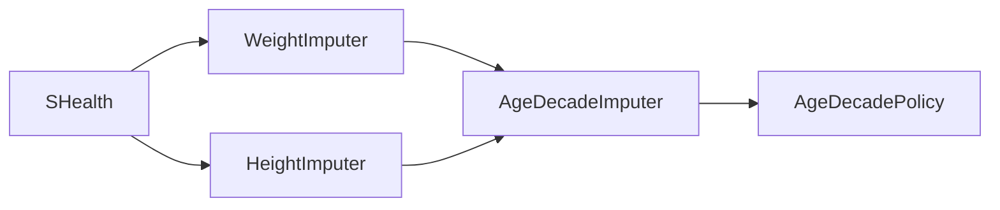

# SHealth_08 — Height가 0인 경우에 대한 평균치 보정 로직 추가 보고서

| 항목 | 내용 |
|------|------|
| **프로젝트명** | SHealth BMI (C++) |
| **작성일** | 2026-05-20 |
| **단계** | Activities 4 — 기능 추가 (04-03) |
| **대상** | `heightCm == 0` 연령대별 평균 키 보정, `loadAndCalculate` 파이프라인 확장 |
| **표준** | C++17 |
| **선행 문서** | [04-02단계 — 특정 연령대의 BMI 분포 비율 계산 기능 추가.md](./04-02단계%20—%20특정%20연령대의%20BMI%20분포%20비율%20계산%20기능%20추가.md) · [03-02단계 — Age 평균치 보정 로직 TC.md](./03-02단계%20—%20Age%20평균치%20보정%20로직%20TC.md) |
| **관련 문서** | [04-01단계 SRP에 따른 책임 분리등 리팩토링.md](./04-01단계%20SRP에%20따른%20책임%20분리등%20리팩토링.md) · [03-01단계 — BMI 계산 로직 TC.md](./03-01단계%20—%20BMI%20계산%20로직%20TC.md) |
| **참고 자료** | `bmi.png`, `shealth.dat`, `README.md` Activities 4 |
| **변경 파일** | `SHealth.cpp`, `AgeDecadeImputer.*`, `HeightImputer.*`, `WeightImputer.*`, `CMakeLists.txt`, `SHealthBMITest.cpp`, 테스트 CSV 2종 |

---

## 1. 개요

### 1.1 작업 목적

README Activities 4 요구사항 **「Height가 0인 경우에 대한 평균치 보정 로직 추가」**를 구현한다. 기존에는 `weightKg == 0`인 레코드만 같은 연령대 평균 체중으로 보정했으나, `heightCm == 0`인 경우 `computeBmi()`가 `0.0`을 반환하여 **저체중으로 잘못 분류**될 수 있었다. 본 작업에서 키 결측에 대해 체중 보정과 **동일한 연령대 평균 대체 규칙**을 적용한다.

| 요구사항 | 충족 |
|----------|------|
| `heightCm == 0.0`을 결측 키로 판단 | ✅ |
| 같은 연령대에서 `heightCm > 0.0`인 레코드만 평균 산출 | ✅ |
| 평균을 계산할 수 없는 연령대는 보정하지 않음 | ✅ |
| BMI 계산 **전**에 키 보정 완료 | ✅ |
| 기존 `weightKg == 0` 보정 로직 유지 | ✅ |
| `heightCm < 0.0`은 invalid record로 제외 (기존과 동일) | ✅ |
| 기존 public API·Google Test 회귀 통과 | ✅ **27/27** Green |
| 신규 Google Test 추가 | ✅ 3건 (`SHealthHeightImputationFixture`) |

### 1.2 Before / After (파이프라인)

| 구분 | Before (04-02) | After (04-03) |
|------|----------------|---------------|
| `loadAndCalculate` 순서 | 로드 → **체중 보정** → BMI → 분포 | 로드 → 체중 보정 → **키 보정** → BMI → 분포 |
| `heightCm == 0` | BMI = 0.0 → 저체중 분류 가능 | 연령대 평균 키로 대체 후 BMI 산출 |
| 보정 클래스 | `WeightImputer` | `WeightImputer` + **`HeightImputer`** |
| 공통 로직 | `WeightImputer` 내부 중복 | **`AgeDecadeImputer`** 로 체중·키 공유 |

### 1.3 보정 알고리즘 (`loadAndCalculate` 파이프라인)

```
HealthRecordCsvReader::loadFromFile
  → WeightImputer::imputeMissingWeights      // 연령대별 평균 체중 대체
  → HeightImputer::imputeMissingHeights      // 연령대별 평균 키 대체  ← 신규
  → BmiDistributionAnalyzer::calculateBmis
  → BmiDistributionAnalyzer::computeDistributionsByAgeDecade
```

도메인 규칙 요약:

| 규칙 | 내용 |
|------|------|
| 연령대 | 20, 30, …, 70 (`AgeDecadePolicy`, 10년 단위) |
| 평균 대상 (키) | 동일 연령대에서 `heightCm != 0.0`인 행만 |
| 보정 대상 (키) | 동일 연령대에서 `heightCm == 0.0`인 행 |
| 평균 불가 | 유효 키가 없으면 `averageHeight == 0` → 보정 스킵 |
| invalid | `heightCm < 0.0` → `isValidRecord` false, 로드 시 제외 |
| BMI | 보정된 체중·키로 `computeBmi` → `classifyBmi` |

> **보정 순서**: 체중 보정 → 키 보정. 동일 레코드에 체중·키가 모두 0인 경우, 체중이 먼저 보정된 뒤 키가 보정된다.

---

## 2. 구현 설계

### 2.1 클래스 구조 (SRP · DRY)

04-01 SRP 분리 이후, 체중·키 보정의 **연령대별 평균·대체 패턴이 동일**함에 따라 공통 로직을 `AgeDecadeImputer`로 추출하였다.



| 클래스 | 책임 |
|--------|------|
| `AgeDecadeImputer` | 연령대별 평균 산출(`averageForDecade`), 결측값 일괄 대체(`imputeMissingByAgeDecade`) |
| `WeightImputer` | `weightKg == 0.0` 결측 → 평균 체중 대체 (getter/setter/isMissing 람다 위임) |
| `HeightImputer` | `heightCm == 0.0` 결측 → 평균 키 대체 (동일 패턴) |
| `SHealth` | Facade — `loadAndCalculate`에서 두 Imputer 순차 호출 |

### 2.2 `HeightImputer` (신규)

```cpp
void HeightImputer::imputeMissingHeights(std::vector<HealthRecord>& records) {
    AgeDecadeImputer::imputeMissingByAgeDecade(
        records,
        [](const HealthRecord& record) { return record.heightCm; },
        [](HealthRecord& record, double value) { record.heightCm = value; },
        [](const HealthRecord& record) { return record.heightCm == 0.0; });
}
```

### 2.3 `AgeDecadeImputer` (신규 · 공통)

| 메서드 | 역할 |
|--------|------|
| `averageForDecade(records, ageDecade, getValue, isMissing)` | 연령대 내 `!isMissing` 레코드만 합산·평균 |
| `imputeMissingByAgeDecade(records, getValue, setValue, isMissing)` | 연령대 20~70 순회, 평균 > 0일 때만 결측 행 대체 |

`WeightImputer`는 기존 `averageWeightForDecade` / `imputeMissingWeights` 구현을 제거하고 `AgeDecadeImputer` 위임으로 단순화하였다. **public API(`WeightImputer::imputeMissingWeights`)는 변경 없음.**

### 2.4 `SHealth::loadAndCalculate` 변경

```cpp
WeightImputer::imputeMissingWeights(records_);
HeightImputer::imputeMissingHeights(records_);   // 추가
BmiDistributionAnalyzer::calculateBmis(records_);
```

기존 `getCategoryPercent`, `getDistributionForAgeDecade`, `computeBmi` 등 **public API 시그니처는 변경하지 않음.**

---

## 3. 테스트 설계

### 3.1 Fixture 구성

| Fixture | 용도 | SetUp |
|---------|------|-------|
| `SHealthHeightImputationFixture` | 키 보정·파이프라인·BMI 검증 | `loadFixture(path)` → `loadAndCalculate(resolveDataFilePath(path))` |

03-02 `SHealthAgeImputationFixture`(체중 보정)와 **대칭 구조**로 설계하였다.

### 3.2 검증 전략

| 검증 대상 | 방법 |
|-----------|------|
| 보정 후 BMI | `computeBmiMilli(weight, height)` + `ASSERT_EQ` |
| BMI 분류 | `EXPECT_EQ(classifyBmi(...), BmiCategory::…)` |
| 보정 반영(통합) | 소형 CSV 로드 후 `getCategoryPercent` 정수 % `EXPECT_EQ` |
| 평균 제외 규칙 | 수동 평균 `(h1+h2)/2` 와 `computeBmi` 결과 일치 |
| 보정 스킵 | 전원 `height=0` → BMI 0, 100% 저체중 |

### 3.3 테스트 전용 픽스처 데이터

| 파일 | 목적 |
|------|------|
| `src/test/data/impute_three_members_zero_height.csv` | 50대 3명, id=3 키 0 → (110+95)/2=102.5 cm 보정 |
| `src/test/data/impute_all_zero_heights.csv` | 50대 전원 키 0 → 보정 불가 |

---

## 4. 테스트 케이스 목록

### 4.1 `SHealthHeightImputationFixture` — 키 보정·BMI (3개)

| # | TEST_F 이름 | Given | When | Then |
|---|-------------|-------|------|------|
| 25 | `GivenThreeMemberFixtureWithOneZeroHeight_WhenLoadAndCalculate_ThenBmiUsesDecadeAverageHeight` | 3인 fixture (키 110/95/0 cm, 체중 21 kg) | `loadAndCalculate` + 분포 조회 | 평균 키 102.5 cm, BMI U/O/N 각 33%, 합 100% |
| 26 | `GivenDecadeWithOnlyZeroHeights_WhenLoadAndCalculate_ThenNoImputationAndAllUnderweight` | 전원 height=0 | `loadAndCalculate` | BMI=0, 50대 100% 저체중 |
| 27 | `GivenDecadeAverageExcludesZeroHeights_WhenComputingImputedBmi_ThenAverageMatchesTwoValidMembers` | 110, 95, 0 cm | 수동 평균 (110+95)/2 | 평균=102.5, milli=19988, `Normal` |

> CTest 번호 25~27은 기존 24개 테스트에 이어 discover 된 순서이다.

---

## 5. 소형 fixture · 경계값 선정

### 5.1 `impute_three_members_zero_height.csv`

보정 후 3가지 BMI 구간이 균등(33%씩)하도록 **체중·키를 대칭 설계** (03-02 `impute_three_members.csv`의 체중 보정 시나리오와 동일 패턴).

| id | age | weight (kg) | height (cm) | 보정 후 키 | BMI (근사) | 분류 |
|----|-----|-------------|-------------|------------|------------|------|
| 1 | 55 | 21 | 110 | 110 | 17.36 | Underweight |
| 2 | 56 | 21 | 95 | 95 | 23.27 | Overweight |
| 3 | 57 | 21 | 0 | **102.5** (평균) | 19.99 | Normal |

**milli-BMI 상수** (C++ `computeBmi` 기준):

| 키 (cm) | milli-BMI |
|---------|-----------|
| 110 | 17355 |
| 95 | 23269 |
| 102.5 (보정) | 19988 |

### 5.2 `shealth.dat` 영향

| 항목 | 내용 |
|------|------|
| `height=0` 행 | **현재 데이터셋에 없음** (전수 스캔 기준) |
| 회귀 영향 | 기존 24개 TC 결과 **변경 없음** |
| 체중 보정 | id=93730 (`weight=0`) 등 기존 동작 유지 |

향후 `shealth.dat`에 `height=0` 행이 추가되면, 03-02 id=93730 패턴과 같이 **id·연령대·기대 BMI** 상수 TC를 보강할 수 있다.

### 5.3 `heightCm < 0` (invalid)

03-04 `GivenNegativeHeight_WhenIsValidRecord_ThenReturnsFalse`에서 검증. 로드 파이프라인에 진입하지 않으므로 키 보정 대상이 아니다.

### 5.4 `computeBmi`와 height=0 (미보정 시)

03-01 `GivenShealthObesityBoundaryAndExactThresholds_…`에서 `computeBmi(70.0, 0.0) == 0.0`을 검증한다. 이는 **보정 전** 순수 계산 API 동작이며, 파이프라인 통과 후에는 `HeightImputer`가 먼저 키를 보정한다.

---

## 6. Given-When-Then 예시

### 6.1 파이프라인 통합 (권장 TC)

```cpp
TEST_F(SHealthHeightImputationFixture,
       GivenThreeMemberFixtureWithOneZeroHeight_WhenLoadAndCalculate_ThenBmiUsesDecadeAverageHeight) {
    // Given: 3 members in the 50s; id=3 has height=0 → imputed to (110+95)/2 = 102.5 cm at weight 21 kg
    const size_t recordCount = loadFixture("src/test/data/impute_three_members_zero_height.csv");
    ASSERT_EQ(recordCount, 3u);

    // When: decade-50 distribution is queried after height imputation
    // ...

    // Then: BMIs ~17.4 / ~23.3 / ~20.0 → Underweight / Overweight / Normal (one third each)
    EXPECT_EQ(underweightPercent, 33);
    EXPECT_EQ(normalPercent, 33);
    EXPECT_EQ(overweightPercent, 33);
}
```

### 6.2 보정 스킵 (평균 불가)

```cpp
TEST_F(SHealthHeightImputationFixture,
       GivenDecadeWithOnlyZeroHeights_WhenLoadAndCalculate_ThenNoImputationAndAllUnderweight) {
    // Given: every member in the 50s has height=0 → average unavailable, no imputation
    const size_t recordCount = loadFixture("src/test/data/impute_all_zero_heights.csv");
    ASSERT_EQ(recordCount, 2u);

    // Then: BMI stays 0 (underweight) and the decade is 100% underweight
    EXPECT_EQ(underweightPercent, 100);
}
```

---

## 7. 빌드·실행 결과

### 7.1 명령

```bash
cmake --build build
ctest --test-dir build --output-on-failure
```

### 7.2 결과 (2026-05-20)

```
100% tests passed, 0 tests failed out of 27
Total Test time (real) = 17.73 sec
```

| 구분 | 테스트 수 | 결과 |
|------|-----------|------|
| 03-01 ~ 03-04 + 04-02 (기존) | 24 | Passed |
| **04-03 `SHealthHeightImputationFixture`** | **3** | **Passed** |

CTest `WORKING_DIRECTORY`는 `${CMAKE_SOURCE_DIR}`이므로 `src/test/data/*.csv`와 `shealth.dat`를 프로젝트 루트 기준으로 읽는다.

---

## 8. 변경 파일 요약

| 파일 | 변경 |
|------|------|
| `src/main/cpp/AgeDecadeImputer.h` | **신규** — 연령대별 평균·보정 공통 API |
| `src/main/cpp/AgeDecadeImputer.cpp` | **신규** — `averageForDecade`, `imputeMissingByAgeDecade` 구현 |
| `src/main/cpp/HeightImputer.h` | **신규** — `imputeMissingHeights` |
| `src/main/cpp/HeightImputer.cpp` | **신규** — `AgeDecadeImputer` 위임 |
| `src/main/cpp/WeightImputer.cpp` | `AgeDecadeImputer` 위임으로 리팩터링 (동작 동일) |
| `src/main/cpp/WeightImputer.h` | private `averageWeightForDecade` 제거 |
| `src/main/cpp/SHealth.cpp` | `HeightImputer::imputeMissingHeights` 호출 추가 |
| `CMakeLists.txt` | `AgeDecadeImputer.cpp`, `HeightImputer.cpp` 라이브러리 등록 |
| `src/test/cpp/SHealthBMITest.cpp` | `SHealthHeightImputationFixture` + `TEST_F` 3개 |
| `src/test/data/impute_three_members_zero_height.csv` | **신규** |
| `src/test/data/impute_all_zero_heights.csv` | **신규** |
| `SHealth.h` | 변경 없음 (public API 유지) |
| `SHealthBMI.cpp` | 변경 없음 |

---

## 9. 커버리지·한계

### 9.1 커버 범위

| 영역 | 커버 여부 |
|------|-----------|
| `heightCm == 0` 결측 판정 | ✅ |
| 평균 계산 시 height=0 제외 | ✅ (수동 평균 + fixture) |
| `imputeMissingHeights` 성공 경로 | ✅ (3인 fixture) |
| 평균 불가 시 보정 스킵 | ✅ (`impute_all_zero_heights.csv`) |
| 보정 후 BMI / 분류 / 연령대 분포 | ✅ milli-BMI·`BmiCategory`·% |
| `loadAndCalculate` E2E | ✅ 소형 CSV |
| 체중 보정 회귀 | ✅ 기존 `SHealthAgeImputationFixture` 5건 통과 |
| `shealth.dat` 내 height=0 실데이터 | ⚠️ 현재 결측 행 없음 — 합성 fixture로 검증 |
| 체중·키 **동시** 0인 레코드 | ⚠️ 전용 TC 미작성 |
| `averageValue == 0.0` 스킵 조건 | ⚠️ 유효 평균이 실제 0인 극단 케이스와 “보정 불가” 미구분 (체중·키 공통) |

### 9.2 03-02(체중 보정) 대비 보완

| 항목 | 03-02 | 04-03 |
|------|-------|-------|
| 결측 필드 | `weightKg == 0` | `heightCm == 0` |
| 공통 인프라 | `WeightImputer` 단독 | `AgeDecadeImputer` + `HeightImputer` |
| shealth.dat 결측 행 | id=93730 (1건) | 없음 |
| 소형 fixture | `impute_three_members.csv` | `impute_three_members_zero_height.csv` |

### 9.3 향후 확장 제안

1. **`DataImputer` Facade** — `imputeAll(records)`로 체중·키 보정 순서 캡슐화
2. **체중·키 동시 결측 TC** — 보정 순서(체중→키)가 BMI에 미치는 영향 명시 검증
3. **`shealth.dat` height=0 행** 추가 시 id 기반 기대 BMI TC (03-02 93730 패턴)
4. **테스트 접근자** — `AgeDecadeImputer::averageForDecade` 직접 assert (private 간접 검증 대체)
5. **README** — 프로젝트 구조·파이프라인 다이어그램에 `HeightImputer` 반영

---

## 10. 결론

- 연령대 **`heightCm == 0` 평균 키 보정**을 `HeightImputer`로 추가하고, `loadAndCalculate` 파이프라인에 **체중 보정 직후·BMI 계산 전** 단계로 삽입하였다.
- 체중·키 보정의 중복을 **`AgeDecadeImputer`**로 추출하여 SRP를 유지하면서 DRY를 달성하였다.
- Google Test **3건**으로 보정 성공(33/33/33% 분포), 평균 산출 시 0 제외, 보정 스킵(100% 저체중)을 검증하였다.
- 기존 **24개** + 신규 **3개** = **전체 27개** 테스트가 **Green**이며, public API 변경 없이 README Activities 4 항목을 충족한다.
