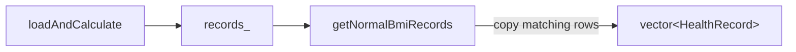

# SHealth_08 — BMI 정상 범위 사용자 목록 조회 기능 추가 보고서

| 항목 | 내용 |
|------|------|
| **프로젝트명** | SHealth BMI (C++) |
| **작성일** | 2026-05-20 |
| **단계** | Activities 4 — 기능 추가 (04-04) |
| **대상** | `SHealth::getNormalBmiRecords` 신규 API |
| **표준** | C++17 |
| **선행 문서** | [04-03단계 — Height가 0인 경우에 대한 평균치 보정 로직 추가.md](./04-03단계%20—%20Height가%200인%20경우에%20대한%20평균치%20보정%20로직%20추가.md) |
| **관련 문서** | [03-03단계 — 정상·저체중·과체중·비만 분류 TC.md](./03-03단계%20—%20정상·저체중·과체중·비만%20분류%20TC.md) · [04-02단계 — 특정 연령대의 BMI 분포 비율 계산 기능 추가.md](./04-02단계%20—%20특정%20연령대의%20BMI%20분포%20비율%20계산%20기능%20추가.md) |
| **참고 자료** | `bmi.png`, `shealth.dat`, `README.md` |
| **변경 파일** | `SHealth.h`, `SHealth.cpp`, `SHealthBMITest.cpp` |

---

## 1. 개요

### 1.1 작업 목적

04-03까지 `loadAndCalculate()` 파이프라인으로 개별 사용자 BMI가 `records_`에 계산·저장되었으나, **정상 BMI 구간에 해당하는 사용자를 목록으로 조회하는 public API**는 없었다. 본 작업에서 `classifyBmi`와 동일한 판정 기준으로 필터링한 `HealthRecord` 벡터를 반환하는 조회 API를 추가한다.

| 요구사항 | 충족 |
|----------|------|
| `getNormalBmiRecords()` public API 추가 | ✅ |
| `loadAndCalculate()` 이후 계산된 `records_` 기준 | ✅ |
| `classifyBmi(record.bmi) == Normal`만 반환 | ✅ |
| 기존 `HealthRecord` 구조체 재사용 | ✅ |
| 원본 `records_` 미수정 (복사본 반환) | ✅ |
| 미로드 시 빈 `vector` 반환 | ✅ |
| 기존 Google Test 회귀 통과 | ✅ **29/29** Green |
| 신규 Google Test 추가 | ✅ 2건 |

### 1.2 Before / After (조회 방식)

| 구분 | Before (04-03) | After (04-04) |
|------|----------------|---------------|
| 정상 BMI 사용자 조회 | **없음** (내부 `records_`만 보유) | `getNormalBmiRecords()` 1회 |
| 판정 기준 | `classifyBmi` static (단건) | 동일 규칙으로 **전체 레코드 필터** |
| 반환 타입 | — | `std::vector<HealthRecord>` |
| 연령대별 비율 | `getCategoryPercent` / `getDistributionForAgeDecade` | **변경 없음** (집계 API와 보완 관계) |

### 1.3 정상 BMI 판정 기준 (`bmi.png` · README)


| 구간 (한글) | 영문 enum | README / 도메인 | `classifyBmi` 구현 (`BmiCalculator`) |
|-------------|-----------|-----------------|--------------------------------------|
| 저체중 | `Underweight` | BMI ≤ 18.5 | `bmi <= 18.5` |
| **정상** | **`Normal`** | **18.5 초과 ~ 23 미만** | **`18.5 < bmi < 23.0`** |
| 과체중 | `Overweight` | 23 이상 ~ 25 미만 | `bmi < 25.0` |
| 비만 | `Obesity` | BMI ≥ 25 | 그 외 |

본 API는 위 **정상** 구간에 해당하는 레코드만 반환한다. 경계값 18.5·23.0은 각각 저체중·과체중으로 분류되므로 결과 목록에 포함되지 않는다.

---

## 2. 추가된 public API

### 2.1 선언 (`SHealth.h`)

```cpp
std::vector<HealthRecord> getNormalBmiRecords() const;
```

`SHealth`에서는 `using HealthRecord = ::HealthRecord;`로 기존과 동일하게 노출한다.

### 2.2 반환 구조체 (`HealthRecord.h`)

```cpp
struct HealthRecord {
    int id = 0;
    int age = 0;
    double weightKg = 0.0;
    double heightCm = 0.0;
    double bmi = 0.0;
};
```

반환 벡터의 각 요소는 `loadAndCalculate` 완료 후 `records_`에 저장된 값의 **복사본**이다 (id, age, 보정된 체중·키, 계산된 bmi 포함).

### 2.3 사용 예

```cpp
SHealth analyzer;
const size_t count = analyzer.loadAndCalculate(
    SHealth::resolveDataFilePath("shealth.dat"));
if (count == 0) {
  // 로드 실패
}

const std::vector<SHealth::HealthRecord> normalUsers =
    analyzer.getNormalBmiRecords();

for (const SHealth::HealthRecord& record : normalUsers) {
    // record.id, record.bmi, ...
    assert(SHealth::classifyBmi(record.bmi) == SHealth::BmiCategory::Normal);
}
```

---

## 3. 구현 방식

### 3.1 구현 코드 (`SHealth.cpp`)

```cpp
std::vector<SHealth::HealthRecord> SHealth::getNormalBmiRecords() const {
    if (records_.empty()) {
        return {};
    }

    std::vector<HealthRecord> normalRecords;
    normalRecords.reserve(records_.size());

    for (const HealthRecord& record : records_) {
        if (classifyBmi(record.bmi) == BmiCategory::Normal) {
            normalRecords.push_back(record);
        }
    }

    return normalRecords;
}
```

### 3.2 데이터 흐름



| 단계 | 설명 |
|------|------|
| `loadAndCalculate` | CSV 로드 → 체중·키 보정 → BMI 계산 → `records_`·`distributionsByDecade_` 저장 |
| `getNormalBmiRecords` | `records_` 순회, `classifyBmi(record.bmi) == Normal`인 행만 `push_back` |
| 미로드 / 로드 실패 | `records_.empty()` → `{}` 반환 |
| 원본 보존 | `records_`는 읽기만 하며, 반환 벡터는 별도 할당 |

### 3.3 빈 벡터가 반환되는 경우

| 상황 | `getNormalBmiRecords` |
|------|------------------------|
| `loadAndCalculate` 미호출 | `{}` |
| 존재하지 않는 파일로 로드 (`recordCount == 0`) | `{}` |
| 로드 후 정상 BMI 사용자 0명 | `{}` (이론상 `shealth.dat`에서는 발생하지 않음) |
| 로드 후 정상 BMI 1명 이상 | 해당 레코드 복사본들 |

### 3.4 기존 API와의 관계

| API | 관점 | 데이터 소스 |
|-----|------|-------------|
| `getCategoryPercent(decade, Normal)` | 연령대별 **정상 비율(%)** | `distributionsByDecade_` |
| `getDistributionForAgeDecade(decade)` | 연령대별 **4범주 비율 일괄** | 동일 |
| **`getNormalBmiRecords()`** | **개별 사용자 목록** (정상만) | `records_` |

집계 API는 “몇 %인가”를, 본 API는 “누구인가”를 제공한다. 동일 `shealth.dat`에서 50대 `normalPercent`와 `getNormalBmiRecords()` 결과를 직접 1:1 대응시키지는 않는다 (전 연령대·전체 레코드 기준 필터).

### 3.5 의도적으로 변경하지 않은 것

| 항목 | 사유 |
|------|------|
| `SHealthBMI.cpp` | 요구 범위 외; 기존 연령대별 분포 출력 유지 |
| `records_` 가변성 | 조회 전용 — 쓰기 없음 |
| 다른 카테고리 조회 API | 요구 범위는 정상 BMI만 |
| `CMakeLists.txt` | 소스 파일 추가 없음 |

---

## 4. 테스트 설계 및 케이스

### 4.1 신규 `TEST_F` (2건)

| # | Fixture | TEST_F | 검증 내용 |
|---|---------|--------|-----------|
| 1 | `SHealthLoadedDataFixture` | `GivenLoadedShealthDat_WhenGetNormalBmiRecords_ThenEveryRecordIsNormalCategory` | `shealth.dat` 로드 후: 결과 비어 있지 않음, 전원 `Normal`, BMI ∈ (18.5, 23.0) |
| 2 | `SHealthExceptionFixture` | `GivenUnloadedAnalyzer_WhenGetNormalBmiRecords_ThenReturnsEmpty` | 미로드 시 빈 벡터 |

### 4.2 Given-When-Then 요약

**#1 — 실데이터 정상 목록**

- **Given**: `SHealthLoadedDataFixture` SetUp에서 `shealth.dat` 로드 (체중·키 보정·BMI 계산 완료)
- **When**: `getNormalBmiRecords()` 호출
- **Then**:
  - `ASSERT_GT(normalRecords.size(), 0u)`
  - 각 레코드: `EXPECT_EQ(classifyBmi(record.bmi), Normal)`
  - 각 레코드: `EXPECT_GT(record.bmi, 18.5)`, `EXPECT_LT(record.bmi, 23.0)`

**#2 — 미로드 예외**

- **Given**: `loadAndCalculate` 호출 없는 `SHealth` 인스턴스
- **When**: `getNormalBmiRecords()` 호출
- **Then**: `EXPECT_TRUE(normalRecords.empty())`

### 4.3 대표 검증 샘플 (03-03 연계)

`shealth.dat`에서 03-03 TC로 검증된 **정상** 대표 id는 본 API 결과 집합에 포함될 수 있다.

| id | BMI (대략) | `classifyBmi` |
|----|------------|---------------|
| 93711 | 21.337 | `Normal` |

반면 93705(비만), 93708(과체중), 93795(저체중) 등은 결과에 **포함되지 않아야** 한다 (본 TC는 반환 목록 전체에 대해 `Normal`만 검증).

### 4.4 회귀 범위

04-03 이후 **27개** 기존 `TEST_F` + 본 단계 **2개 신규** = **29개** 전부 Green.

---

## 5. 변경 파일 목록

| 파일 | 변경 내용 |
|------|-----------|
| `src/main/cpp/SHealth.h` | `getNormalBmiRecords` 선언 1줄 |
| `src/main/cpp/SHealth.cpp` | 필터·복사 구현 약 16줄 |
| `src/test/cpp/SHealthBMITest.cpp` | 신규 2 `TEST_F` |
| `src/main/cpp/SHealthBMI.cpp` | 변경 없음 |
| `CMakeLists.txt` | 변경 없음 |

---

## 6. 빌드·테스트 결과

### 6.1 명령

```powershell
cd build
cmake --build .
ctest --output-on-failure
```

### 6.2 결과 (2026-05-20)

```
100% tests passed, 0 tests failed out of 29
Total Test time (real) ≈ 15.7 sec
```

| 구간 | 신규 CTest | 내용 |
|------|------------|------|
| 04-04 조회 | #19 | `shealth.dat` 로드 후 정상 목록 전원 `Normal` |
| 03-04 예외 | #14 | 미로드 시 빈 벡터 |

04-03 대비: **27 → 29** tests (+2 신규, +0 실패).

---

## 7. API 비교표 (Facade 조회 계층)

| 메서드 | 입력 | 출력 | 질문에 답하는 내용 |
|--------|------|------|-------------------|
| `getCategoryPercent` | decade + category | `double` (%) | “이 연령대에서 정상은 몇 %?” |
| `getDistributionForAgeDecade` | decade | `AgeDecadeDistribution` | “이 연령대 4범주 비율은?” |
| `sumCategoryPercents` | decade | `double` (합) | “이 연령대 비율 합은 100?” |
| **`getNormalBmiRecords`** | **없음** | **`vector<HealthRecord>`** | **“정상 BMI 사용자는 누구?”** |

---

## 8. 한계·향후 개선

| 항목 | 현재 상태 | 제안 |
|------|-----------|------|
| 다른 BMI 구간 조회 | 정상만 제공 | `getRecordsByCategory(BmiCategory)` 등 일반화 |
| 연령대·나이 필터 | 없음 | `getNormalBmiRecordsForAgeDecade(int)` 오버로드 |
| `SHealthBMI.cpp` 출력 | 분포만 출력 | 정상 사용자 수·id 목록 CLI 옵션 |
| 대용량 할당 | 매 호출 전체 스캔·복사 | lazy view, 인덱스 캐시, 또는 id만 반환 API |
| 정상 사용자 수만 필요 | `vector` 크기로 유추 | `countNormalBmiRecords()` 전용 API |
| 정상 목록 vs 연령대 비율 일치 검증 | 별도 TC 없음 | 소형 fixture로 집계·목록 교차 검증 TC 추가 |

---

## 9. 결론

- **`getNormalBmiRecords()`** 로 `loadAndCalculate()` 이후 **정상 BMI 사용자 목록**을 기존 `HealthRecord` 타입으로 조회할 수 있게 하였다.
- 판정은 **`SHealth::classifyBmi`와 동일**하며, **18.5 < BMI < 23.0** 구간만 포함한다.
- 원본 `records_`는 변경하지 않고, 미로드 시 **빈 벡터**를 반환한다.
- **29/29** Google Test Green으로 03~04-03 회귀 및 신규 동작을 검증하였다.
- CLI·타 구간 조회는 후속 단계(04-05 이후)에서 확장할 수 있다.
