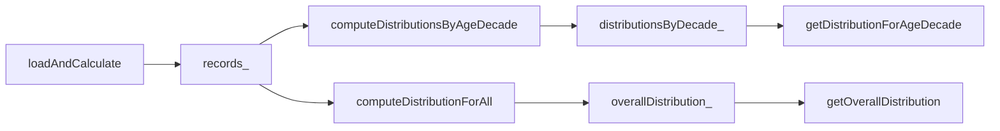

# SHealth_08 — 전체 사용자 대비 각 BMI 범주 비율 계산 기능 추가 보고서

| 항목 | 내용 |
|------|------|
| **프로젝트명** | SHealth BMI (C++) |
| **작성일** | 2026-05-20 |
| **단계** | Activities 4 — 기능 추가 (04-05) |
| **대상** | `SHealth::getOverallDistribution` · `getOverallCategoryPercent` · `sumOverallCategoryPercents` |
| **표준** | C++17 |
| **선행 문서** | [04-04단계 — BMI 정상 범위 사용자 목록 조회 기능 추가.md](./04-04단계%20—%20BMI%20정상%20범위%20사용자%20목록%20조회%20기능%20추가.md) |
| **관련 문서** | [04-02단계 — 특정 연령대의 BMI 분포 비율 계산 기능 추가.md](./04-02단계%20—%20특정%20연령대의%20BMI%20분포%20비율%20계산%20기능%20추가.md) · [03-03단계 — 정상·저체중·과체중·비만 분류 TC.md](./03-03단계%20—%20정상·저체중·과체중·비만%20분류%20TC.md) |
| **참고 자료** | `bmi.png`, `shealth.dat`, `README.md` |
| **변경 파일** | `SHealth.h`, `SHealth.cpp`, `BmiDistributionAnalyzer.h`, `BmiDistributionAnalyzer.cpp`, `SHealthBMITest.cpp` |

---

## 1. 개요

### 1.1 작업 목적

04-02까지는 **특정 연령대(20·30·…·70)** 기준으로 BMI 4범주 비율을 제공했다. README Activities 4 마지막 항목인 **전체 사용자(모든 연령·모든 레코드) 대비 각 BMI 범주 비율** 조회 API를 추가하여, 연령대 필터 없이 집계된 분포를 한 번에 조회할 수 있게 한다.

| 요구사항 | 충족 |
|----------|------|
| `loadAndCalculate()` 이후 전체 레코드 기준 비율 | ✅ |
| 4범주(저체중·정상·과체중·비만) 비율(%) | ✅ |
| `classifyBmi`와 동일 판정·집계 로직 | ✅ |
| 기존 `AgeDecadeDistribution` 구조체 재사용 | ✅ |
| `loadAndCalculate` 시 1회 집계·캐시, 조회 시 재계산 없음 | ✅ |
| 미로드 시 전 필드·단일 조회 `0.0` | ✅ |
| 기존 Google Test 회귀 통과 | ✅ **33/33** Green |
| 신규 Google Test | ✅ 4건 |

### 1.2 Before / After (집계 관점)

| 구분 | Before (04-04) | After (04-05) |
|------|----------------|---------------|
| 전체 사용자 4범주 비율 | **없음** (연령대별만 가능) | `getOverallDistribution()` 1회 |
| 집계 단위 | 연령대 멤버만 (`belongsToAgeDecade`) | **로드된 전체 `records_`** |
| 데이터 소스 | `distributionsByDecade_` | `overallDistribution_` (신규 캐시) |
| 정상 사용자 목록 | `getNormalBmiRecords()` | **변경 없음** (목록 vs 비율 보완) |

### 1.3 BMI 4범주 및 비율 공식 (`bmi.png` · README)


| 구간 (한글) | 영문 enum | 필드명 | `classifyBmi` |
|-------------|-----------|--------|---------------|
| 저체중 | `Underweight` | `underweightPercent` | BMI ≤ 18.5 |
| 정상 | `Normal` | `normalPercent` | 18.5 < BMI < 23.0 |
| 과체중 | `Overweight` | `overweightPercent` | 23.0 ≤ BMI < 25.0 |
| 비만 | `Obesity` | `obesityPercent` | BMI ≥ 25.0 |

**전체 사용자 비율(%)**

```text
비율(%) = (해당 범주 인원 / loadAndCalculate로 적재된 전체 인원) × 100
```

연령대별(04-02)과 달리 분모는 **특정 10년 구간 인원이 아니라 전체 레코드 수**이다.

---

## 2. 추가된 public API

### 2.1 선언 (`SHealth.h`)

```cpp
AgeDecadeDistribution getOverallDistribution() const;
double getOverallCategoryPercent(BmiCategory category) const;
double sumOverallCategoryPercents() const;
```

| 메서드 | 역할 |
|--------|------|
| `getOverallDistribution()` | 4범주 비율을 `AgeDecadeDistribution`으로 일괄 반환 |
| `getOverallCategoryPercent(category)` | 단일 범주 비율(%) |
| `sumOverallCategoryPercents()` | 4범주 합 (로드 후 100에 수렴) |

### 2.2 반환 구조체 (`BmiTypes.h`)

04-02와 동일하게 `AgeDecadeDistribution`을 재사용한다. 이름은 “연령대”이지만 **전체 집계 결과를 담는 DTO**로도 사용한다 (신규 타입 도입 없이 API 일관성 유지).

```cpp
struct AgeDecadeDistribution {
    double underweightPercent = 0.0;
    double normalPercent = 0.0;
    double overweightPercent = 0.0;
    double obesityPercent = 0.0;
};
```

### 2.3 사용 예

```cpp
SHealth analyzer;
const size_t count = analyzer.loadAndCalculate(
    SHealth::resolveDataFilePath("shealth.dat"));
if (count == 0) {
  // 로드 실패
}

const SHealth::AgeDecadeDistribution overall = analyzer.getOverallDistribution();

std::cout << "underweight = " << overall.underweightPercent << '\n';
std::cout << "normal      = " << overall.normalPercent << '\n';
std::cout << "overweight  = " << overall.overweightPercent << '\n';
std::cout << "obesity     = " << overall.obesityPercent << '\n';

// 단일 범주만 필요할 때
const double normalPct =
    analyzer.getOverallCategoryPercent(SHealth::BmiCategory::Normal);
```

---

## 3. 구현 방식

### 3.1 집계 로직 (`BmiDistributionAnalyzer`)

연령대 필터 없이 전 레코드를 순회하는 정적 메서드를 추가하였다.

```cpp
AgeDecadeDistribution BmiDistributionAnalyzer::computeDistributionForAll(
    const std::vector<HealthRecord>& records) {
    CategoryCounts counts;
    int memberCount = 0;

    for (const HealthRecord& record : records) {
        ++memberCount;
        incrementCategoryCount(counts, BmiCalculator::classifyBmi(record.bmi));
    }

    return toPercentDistribution(counts, memberCount);
}
```

`computeDistributionForDecade`와 동일한 `CategoryCounts` · `toPercentDistribution` 경로를 사용하여 **연령대 집계와 전체 집계의 비율 산식이 일치**한다.

### 3.2 Facade·캐시 (`SHealth`)

`loadAndCalculate` 성공 시 연령대 맵과 함께 전체 분포를 1회 계산해 캐시한다.

```cpp
distributionsByDecade_ = BmiDistributionAnalyzer::computeDistributionsByAgeDecade(records_);
overallDistribution_ = BmiDistributionAnalyzer::computeDistributionForAll(records_);
```

조회 구현:

```cpp
SHealth::AgeDecadeDistribution SHealth::getOverallDistribution() const {
    if (records_.empty()) {
        return AgeDecadeDistribution{};
    }
    return overallDistribution_;
}

double SHealth::getOverallCategoryPercent(BmiCategory category) const {
    if (records_.empty()) {
        return 0.0;
    }
    return BmiDistributionAnalyzer::percentForCategory(overallDistribution_, category);
}
```

### 3.3 데이터 흐름



| 단계 | 설명 |
|------|------|
| CSV 로드·보정·BMI 계산 | 기존 파이프라인과 동일 |
| `computeDistributionForAll` | 전 `records_`에 대해 4범주 카운트 → % 변환 |
| `overallDistribution_` | 조회 API는 캐시만 읽음 (중복 스캔 없음) |
| 미로드 | `records_.empty()` → 기본 `AgeDecadeDistribution{}` / `0.0` |

### 3.4 기존 API와의 관계

| API | 집계 범위 | 질문 |
|-----|-----------|------|
| `getCategoryPercent(decade, cat)` | 특정 연령대 | “20대에서 정상은 몇 %?” |
| `getDistributionForAgeDecade(decade)` | 특정 연령대 | “50대 4범주 비율은?” |
| **`getOverallDistribution()`** | **전체 사용자** | **“전체에서 정상은 몇 %?”** |
| `getNormalBmiRecords()` | 전체(필터) | “정상 BMI 사용자는 누구?” |

04-04의 `getNormalBmiRecords().size() / recordCount × 100`은 `getOverallCategoryPercent(Normal)`과 **반올림 기준으로 일치**함을 교차 검증 TC로 확인한다.

### 3.5 의도적으로 변경하지 않은 것

| 항목 | 사유 |
|------|------|
| `SHealthBMI.cpp` | 요구 범위 외; 기존 연령대별 stdout 출력 유지 |
| `AgeDecadeDistribution` 타입명 | 기존 구조체 재사용·호환 우선 |
| `getBmiRatio` 전체 버전 | 레거시 int 코드는 연령대 API만 유지 |
| `CMakeLists.txt` | 신규 소스 파일 없음 |

---

## 4. 테스트 설계 및 케이스

### 4.1 신규 `TEST_F` (4건)

| # | Fixture | TEST_F | 검증 내용 |
|---|---------|--------|-----------|
| 1 | `SHealthExceptionFixture` | `GivenUnloadedAnalyzer_WhenGetOverallDistribution_ThenAllPercentsAreZero` | 미로드 시 일괄·단일·합계 모두 0 |
| 2 | `SHealthLoadedDataFixture` | `GivenLoadedShealthDat_WhenGetOverallDistribution_ThenMatchesOverallCategoryPercentApi` | `shealth.dat`: 각 필드 = `getOverallCategoryPercent` |
| 3 | `SHealthLoadedDataFixture` | `GivenLoadedShealthDat_WhenSummingOverallCategoryPercents_ThenTotalsOneHundred` | 전체 4범주 합 100% |
| 4 | `SHealthLoadedDataFixture` | `GivenLoadedShealthDat_WhenGetOverallCategoryPercent_ThenMatchesNormalRecordsCount` | `normalPercent` ≈ `getNormalBmiRecords().size() / recordCount × 100` |

### 4.2 Given-When-Then 요약 (대표)

**#3 — 전체 합 100%**

- **Given**: `SHealthLoadedDataFixture` SetUp에서 `shealth.dat` 로드
- **When**: `sumOverallCategoryPercents()` 호출
- **Then**: `lround(total) == 100`

**#4 — 04-04 목록 API와 교차 검증**

- **Given**: 동일 fixture, `recordCount_`·`getNormalBmiRecords()` 사용 가능
- **When**: `getOverallCategoryPercent(Normal)` 조회
- **Then**: `lround(normalRecords.size() * 100 / recordCount)`와 일치

### 4.3 회귀 범위

04-04 이후 **29개** 기존 `TEST_F` + 본 단계 **4개 신규** = **33개** 전부 Green.

---

## 5. 변경 파일 목록

| 파일 | 변경 내용 |
|------|-----------|
| `src/main/cpp/BmiDistributionAnalyzer.h` | `computeDistributionForAll` 선언 |
| `src/main/cpp/BmiDistributionAnalyzer.cpp` | 전체 레코드 집계 구현 |
| `src/main/cpp/SHealth.h` | 3개 public API + `overallDistribution_` 멤버 |
| `src/main/cpp/SHealth.cpp` | 로드 시 캐시·조회 구현 |
| `src/test/cpp/SHealthBMITest.cpp` | 신규 4 `TEST_F` |
| `src/main/cpp/SHealthBMI.cpp` | 변경 없음 |
| `CMakeLists.txt` | 변경 없음 |

---

## 6. 빌드·테스트 결과

### 6.1 명령

```powershell
cd build
cmake --build .
ctest --output-on-failure
```

### 6.2 결과 (2026-05-20)

```
100% tests passed, 0 tests failed out of 33
Total Test time (real) ≈ 15.3 sec
```

| 구간 | 신규/관련 CTest | 내용 |
|------|-----------------|------|
| 04-05 전체 비율 | #15, #22–#24 | 미로드 0, shealth.dat 일치·합 100·정상 목록 교차 |
| 04-04 정상 목록 | #21 | `getNormalBmiRecords` (교차 검증 상대) |

04-04 대비: **29 → 33** tests (+4 신규, +0 실패).

---

## 7. API 비교표 (Facade 조회·집계 계층)

| 메서드 | 집계 범위 | 출력 | 호출 횟수 (4범주 전체) |
|--------|-----------|------|------------------------|
| `getDistributionForAgeDecade` | 연령대 1개 | `AgeDecadeDistribution` | 1 |
| `getCategoryPercent` | 연령대 1개·범주 1개 | `double` | 4 |
| **`getOverallDistribution`** | **전체 사용자** | **`AgeDecadeDistribution`** | **1** |
| **`getOverallCategoryPercent`** | **전체·범주 1개** | **`double`** | **1** |
| `getNormalBmiRecords` | 전체(정상만) | `vector<HealthRecord>` | — |

---

## 8. 한계·향후 개선

| 항목 | 현재 상태 | 제안 |
|------|-----------|------|
| `SHealthBMI.cpp` 출력 | 연령대별만 출력 | 전체 4범주 한 줄 요약 추가 |
| 타입 명칭 | `AgeDecadeDistribution`이 전체에도 사용 | `BmiCategoryDistribution` 등 별칭 typedef |
| 연령대 합 vs 전체 | 연령대별 %의 산술 평균 ≠ 전체 % | 문서·UI에서 “가중 평균 아님” 명시 |
| `getBmiRatio` 전체 오버로드 | 없음 | 레거시 호환 필요 시 `getOverallBmiRatio(int code)` |
| 소형 fixture TC | shealth.dat 위주 | 3~5인 CSV로 결정적 전체 % TC 추가 |
| Activities 5 회고 | 04-05로 기능 4종 완료 | Before/After·AI 활용 정리 |

---

## 9. 결론

- **전체 사용자 대비 BMI 4범주 비율**을 `getOverallDistribution` / `getOverallCategoryPercent`로 조회할 수 있게 하였다.
- 집계는 **`loadAndCalculate` 완료 시 1회** 수행되며, `classifyBmi`·연령대 집계와 **동일한 비율 산식**을 사용한다.
- 04-04 **`getNormalBmiRecords`와 정상 비율이 수학적으로 일치**함을 테스트로 검증하였다.
- **33/33** Google Test Green으로 03~04-04 회귀 및 신규 동작을 확인하였다.
- README Activities 4 기능 개선 5항목(04-01~04-05)이 코드·테스트 기준으로 완료되었으며, Activities 5 회고·발표 단계로 이어갈 수 있다.
